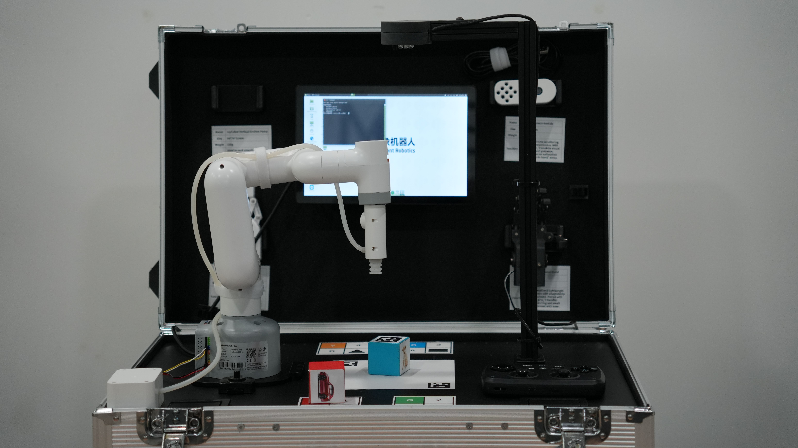

# 2.1 Ai 便携实训箱-280版本

>>（主机及配件需另外选购录单）

| 参数类别  | 详细信息                                       |
|------------------|-----------------------------------------------------------------------------|
| 型号             | 行李箱        |
| 整体尺寸               |640×420×285mm                           |
| 整体重量             | 11.2KG（不含机械臂                               |
|       供电电源       | 	12V 5A |
| 摄像头法兰(标配)             | 	my系列套装摄像头模组                          |
| 触控屏         | 	10.1英寸触摸显示屏 1920*1200                           |
| 键鼠手柄组合           | RK707 USB连接方式 单无线版                   |

## myCobot 280

<table>
<tr>
    <td> 产品 </td>
    <td>图片</td>
    <td>链接</td>
</tr>
<tr>
    <td>myCobot 280 M5</td>
    <td> </td>
    <td><a href="https://docs.elephantrobotics.com/docs/mycobot_280_m5_cn/">简介</a></td>
</tr>
<tr>
    <td>myCobot 280 PI</td>
    <td> </td>
    <td><a href="https://docs.elephantrobotics.com/docs/mycobot_280_m5_en/">简介</a></td>
</tr>
</table>

| 参数类别       | 详细信息 |
| :-----------: | :---------: |
| 型号         | myCobot 280 for M5 |
| 自由度       | 6          |
| 有效负载     | 250g       |
| 工作半径     | 280mm      |
| 重复定位精度 | ±0.5mm  |
| 重量         | 800g       |
| 电源输入     | 12V，5A       |
| 工作温度     | -5-45℃     |
| 通信         | Type-C     |

| 参数类别       | 详细信息 |
| :-----------: | :---------: |
| 型号         | myCobot 280 Raspberry Pi 2023 |
| 自由度       | 6          |
| 有效负载     | 250g       |
| 工作半径     | 280mm      |
| 重复定位精度 | ±0.5mm  |
| 重量         | 800g       |
| 电源输入     | 12V，5A       |
| 工作温度     | -5-45℃     |
| 通信         | Type-C     |

---

[← 上一页](./README.md) | [下一页 →](./2.2-270_version.md)
