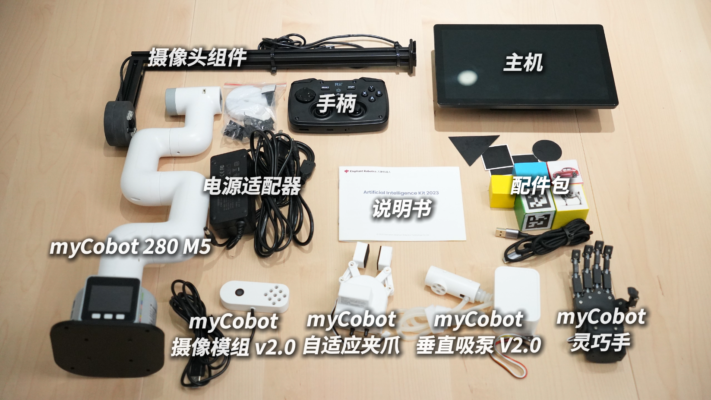

# 首次开箱

## 4.1 安装视频

<video id="my-video" class="video-js" controls preload="auto" width="100%"
poster="" data-setup='{"aspectRatio":"16:9"}'>
  <source src="../resources/4-FirstInstallAndUse/unboxing_video.mp4"></video>

## 4.2 物料清单

---

[← 上一章](../3-UserNotes/README.md) | [下一章 →](../5-BasicApplication/README.md)
