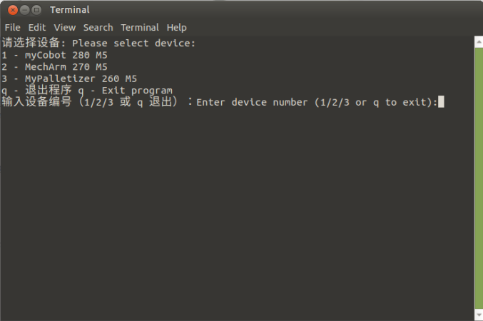
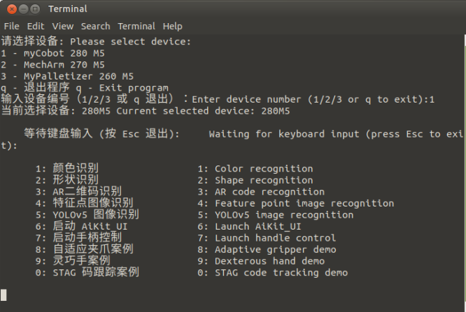
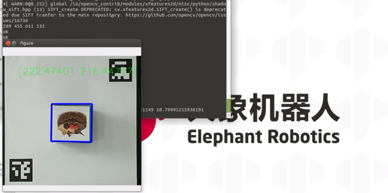
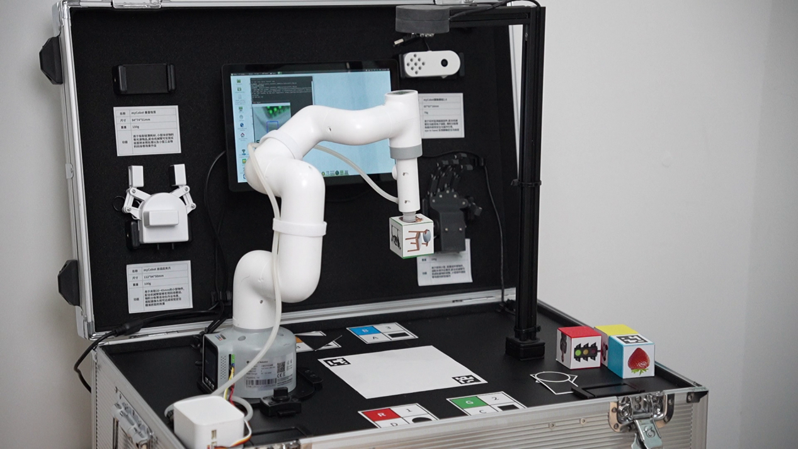

# 特征点识别

系统开机后，会自动启动程序，该程序支持启动颜色识别、形状识别、特征点图像识别、AR二维码识别、YOLOv5 图像识别、AiKit_UI程序、手柄控制程序、myCobot自适应夹爪案例、myCobot五指灵巧手案例以及stag码跟踪案例。

>>注意：M5版本机器使用前需选择设备型号，PI版本则不需要。

根据终端信息提示，选择对应机械臂型号，如果是PI版本设备，则忽略此步骤。这里以280M5为例，输入1：

**按下数字4，启动特征点图像识别功能。将特征点图像木块放置识别区域，机械臂将执行抓取流程。**

**演示视频:** 

<video id="my-video" class="video-js" controls preload="auto" width="100%"
poster="" data-setup='{"aspectRatio":"16:9"}'>
  <source src="../resources/5-BasicAlgorithmFunction/FeaturePointRecognition.mp4"></video>