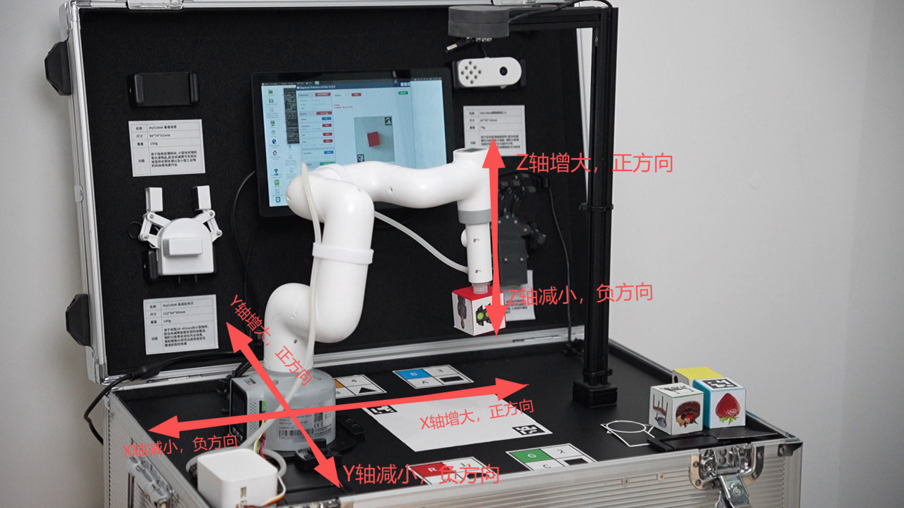
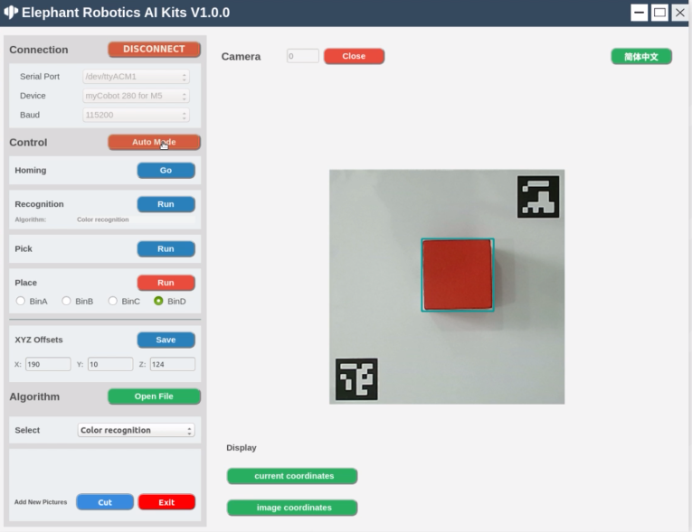
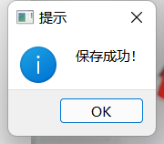

# 注意事项

## 坐标偏移量修改

当运行1-5识别算法功能时，如果机械臂无法准确抓取可识别物体或木块，需根据不同的算法调整XYZ偏移量，可以按下**数字6启动AiKit_UI图形化软件**进行修改偏移量：

X 偏移量、Y 偏移量、Z 偏移量分别代表的是机械臂坐标X轴、Y轴、Z轴的位置，可以根据实际需求进行修改，点击’保存‘按钮进行保存，保存成功后将会按照最新点位进行抓取。

## 其他事项

1. 键盘按键 1 ~ 5 识别算法功能中的坐标抓取偏移量依赖Aikit_UI中的偏移量，所以调整坐标偏移量需输入**按键 6** 启动AiKit_UI程序进行修改保存。
2. 该程序支持识别算法功能直接切换，比如当前运行的是颜色识别功能，可直接输入2切换到形状识别功能。如果当前运行的是 AiKit_UI程序，需要在UI程序右上角手动关闭程序后， 才能按键输入切换其他识别算法功能。
3. 当摄像头没有正确自动框出识别区域，需要关闭程序，调整摄像头的位置，可将摄像头向左向右移动等操作。
4. OpenCV颜色识别会受环境的影响，若处在较为昏暗、光亮的环境下识别效果将大大降低。
5. 识别算法功能中，不同的功能对应不同的识别物料，请正确选择使用。
6. myPalletizer 260设备只有1-8功能按键，mechArm 270设备只有1-9功能按键。