# AiKit UI 使用

系统开机后，会自动启动程序，该程序支持启动颜色识别、形状识别、特征点图像识别、AR二维码识别、YOLOv5 图像识别、AiKit_UI程序、手柄控制程序、myCobot自适应夹爪案例、myCobot五指灵巧手案例以及stag码跟踪案例。

使用Python + Opencv + pyqt5 在机械臂上进行颜色识别、形状识别、特征点图像识别、AR二维码识别和 YOLOv5 图像识别

>>注意：M5版本机器使用前需选择设备型号，PI版本则不需要。

根据终端信息提示，选择对应机械臂型号，如果是PI版本设备，则忽略此步骤。这里以280M5为例，输入1：

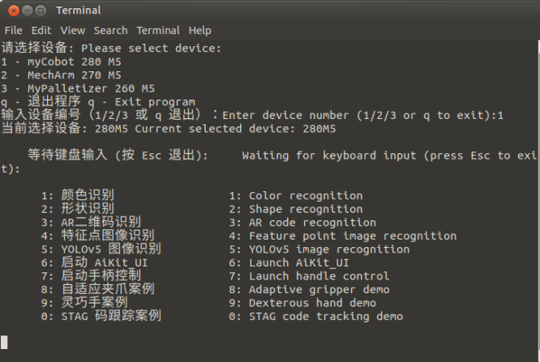

**按下数字6，启动AiKit_UI图形化程序，可直接使用各种算法识别功能。这里以颜色识别为例**

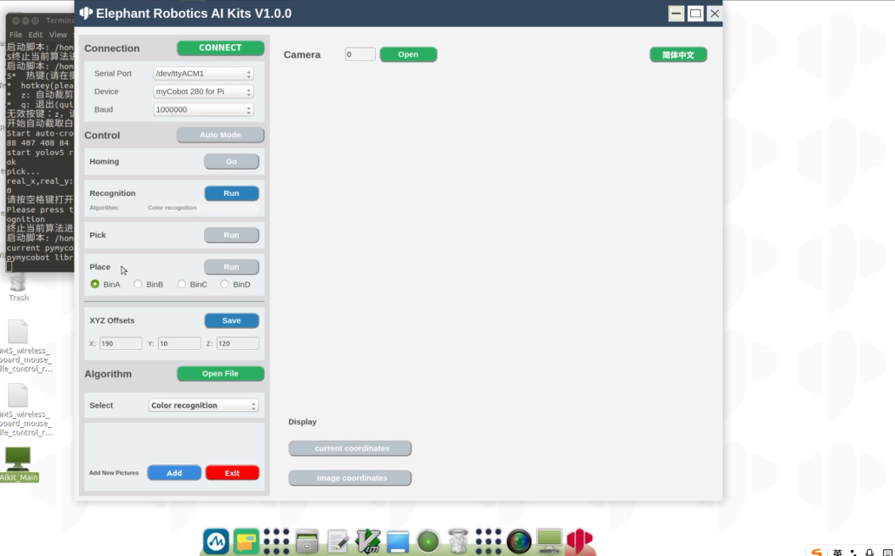

**演示视频:** 

<video id="my-video" class="video-js" controls preload="auto" width="100%"
poster="" data-setup='{"aspectRatio":"16:9"}'>
  <source src="../resources/5-BasicAlgorithmFunction/AIKIT-UI.mp4"></video>

## 功能介绍

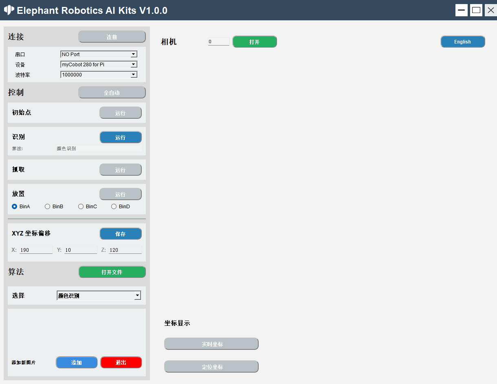

#### 语言切换

点击窗口右上角的按钮可以进行语言（中文、英文）之间的切换。 
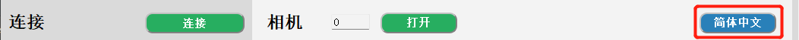

#### 设备连接

1. 选择串口、设备、波特率 
   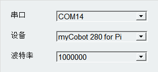
2. 点击'连接'按钮进行连接，连接成功之后’连接‘按钮会变成'断开' 
   
3. 点击’断开‘按钮会断开与机械臂的连接 
   
4. 成功连接机械臂之后，灰色按钮将会被点亮，变为可点击状态。 
   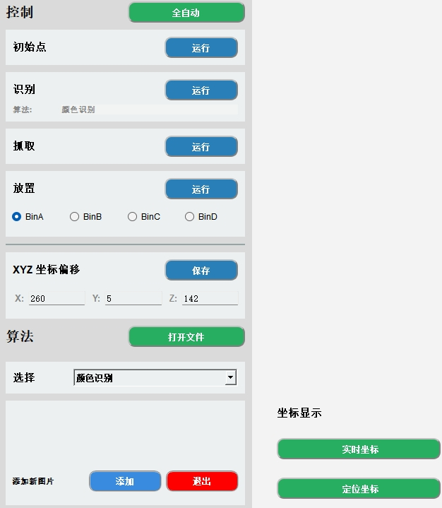

#### 打开相机

1. 设置相机序号，默认的序号为0，Windows使用时，通常序号为1，Linux使用时，序号通常为0。 
   

2. 点击‘打开’按钮则可以尝试打开相机，若是打开失败，则应该尝试更改相机序号；相机成功打开如下图所示：
   注意：使用之前应该调整摄像头刚好在二维码白板的正上方，且呈一条直线正对机械臂。 

   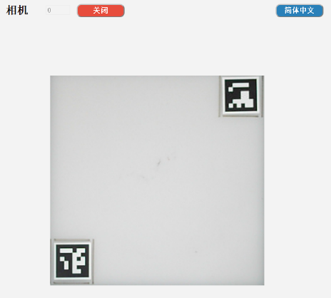

3. 成功打开摄像头之后，点击'关闭'按钮关闭摄像头 
   

#### 算法控制

1. 全自动模式，点击'全自动'按钮之后，识别、抓取、放置将一直处于打开状态；再次点击'全自动'按钮关闭全自动模式。 
   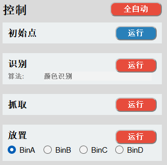

2. 回到抓取初始点位，点击’运行‘按钮，会停止当前正进行的操作，回到初始点位。 
   

3. 逐步操作模式
   识别：点击’运行‘按钮开始识别，算法是当前使用的算法。 
   
   抓取：点击’运行‘按钮开始抓取，抓取成功之后，自动关闭识别和抓取，下次使用需要再次点击。 
   
   放置：点击’运行‘按钮开始放置，BinA，BinB，BinC，BinD选择框分别对应BinA，BinB，BinC，BinD4个存储盒，选择后会放置到指定的存储盒。 
   

4. 抓取点位调节，X 偏移量、Y 偏移量、Z 偏移量分别代表的是机械臂坐标X轴、Y轴、Z轴的位置，可以根据实际需求进行修改，点击’保存‘按钮进行保存，保存成功后将会按照最新点位进行抓取。 
    
   

5. 打开文件位置，我们的代码是开源的，你可以根据自己的需求进行修改，点击’打开 File‘按钮会打开文件所在位置。 
   
   打开’main.py‘文件进行修改即可 
   
   
6. 算法选择，分别有颜色识别，形状识别，二维码识别，特征点识别 yolov5，选择对应的算法将进行对应的识别。 

   

7. 为‘特征点识别‘添加图片 
   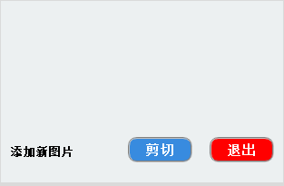
   点击’添加'按钮，则会打开相机以及出现提示。 
   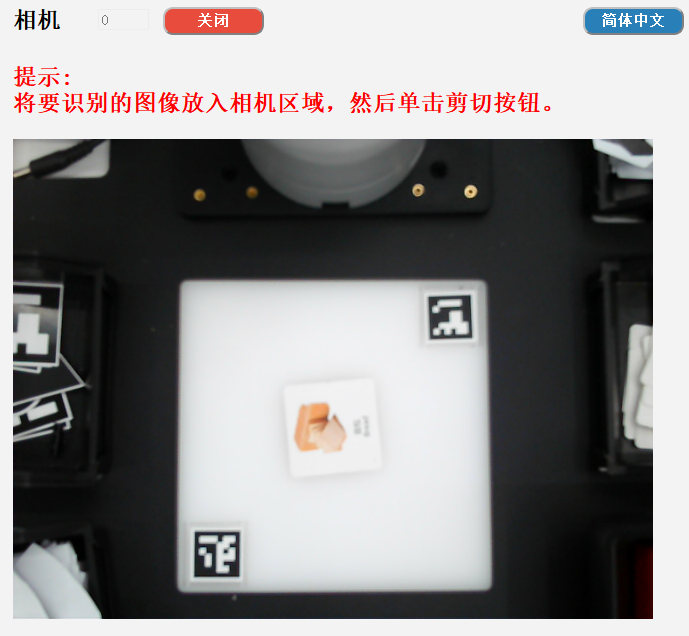
   点击‘剪切’按钮，则会截取当前相机内容，并给出提示‘框出需要保存的内容后按下ENTER键’ 

   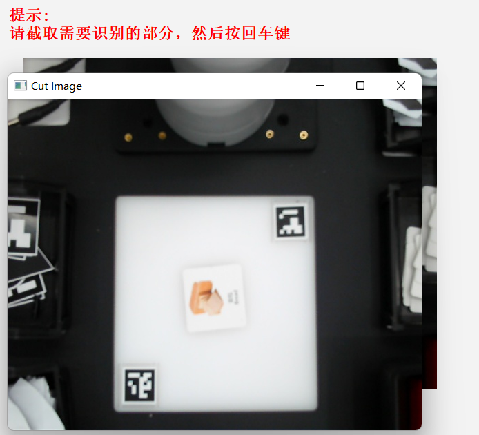
   框出需要保存的内容后按下ENTER键，开始选择保存的区域，分别对应BinA，BinB，BinC，BinD4个存储盒。 

   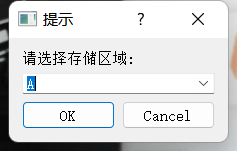
   此处会显示截取的内容 
   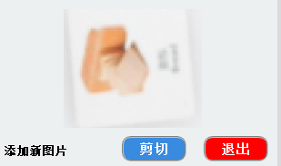

   可进入以下路径查看保存的图片 
   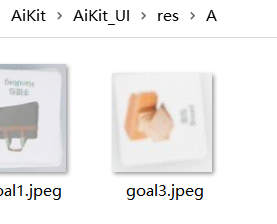

8. 点击‘退出'按钮退出图片添加，注意：若是开始截取，请截取完之后再退出，可选择不保存截取的图片。 
   

#### 坐标显示

1. 机械臂实时坐标显示：点击’实时坐标'按钮开启 
   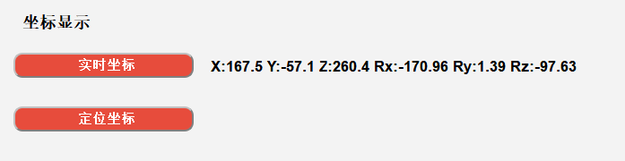
2. 识别坐标显示：点击''定位坐标'按钮开启 
   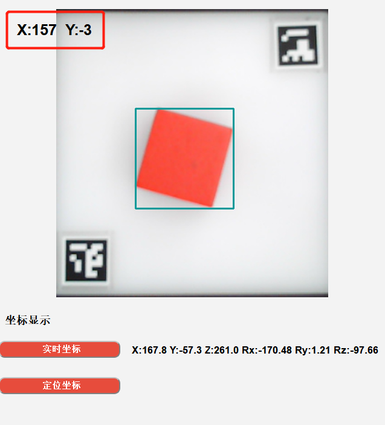
