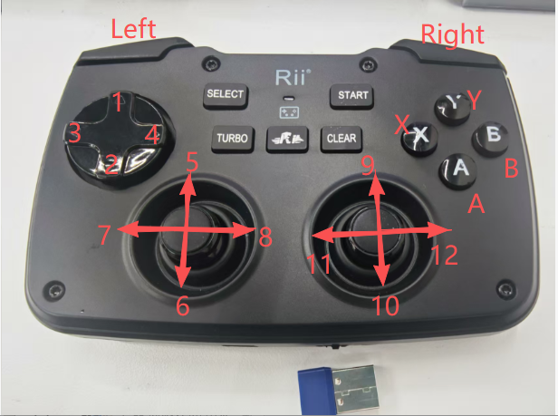
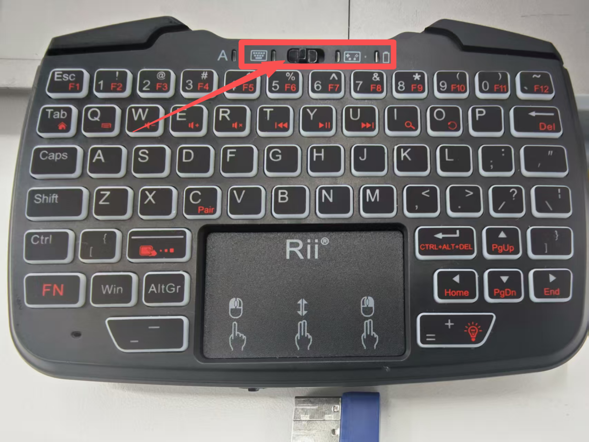
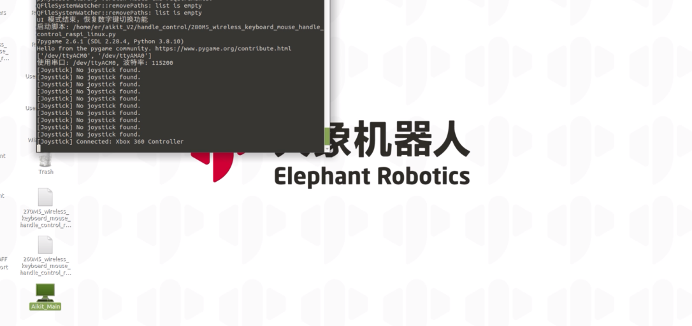
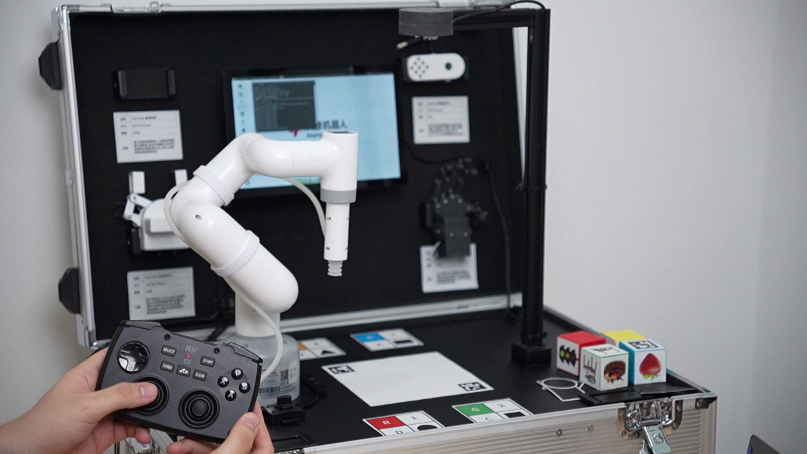

# 手柄控制

系统开机后，会自动启动程序，该程序支持启动颜色识别、形状识别、特征点图像识别、AR二维码识别、YOLOv5 图像识别、AiKit_UI程序、手柄控制程序、myCobot自适应夹爪案例、myCobot五指灵巧手案例以及stag码跟踪案例。

可以通过手柄来控制机器的运动，实现使用夹爪或者吸泵来抓取物体。

- 手柄按键功能如下：

- **1**：RX坐标值增大
- **2**：RX坐标值减小
- **3**：RY坐标值增大
- **4**：RY坐标值减小
- **5**：X坐标值增大
- **6**：X坐标值减小
- **7**：Y坐标值增大
- **8**：Y坐标值减小
- **9**：Z坐标值减小
- **10**：Z坐标值增大
- **11**：RZ坐标值减小
- **12**：RZ坐标值增大
- **X**：点击按钮，自适应夹爪张开
- **Y**：点击按钮，自适应夹爪关闭
- **A**：点击按钮，打开吸泵
- **B**：点击按钮，关闭吸泵
- **Left1**：长按2s，初始化机器人至关节零位状态。
- **Left2**：长按2s，机器人停止力矩输出，放松所有关节。
- **Right1：长按2s，初始化机器人至移动初始点位。**
- **Right2**：长按2s，机器人打开力矩输出，所有关节锁定。

>>注意：M5版本机器使用前需选择设备型号，PI版本则不需要。

根据终端信息提示，选择对应机械臂型号，如果是PI版本设备，则忽略此步骤。这里以280M5为例，输入1：

**按下数字7，启动手柄控制功能。启动后需将键鼠设备切换到手柄控制模式，手柄按键功能使用参考如下（在运行程序以后，首先要先点击Right 1按钮，机器到达初始点位以后，才可以进行其他的操作。）**

- 手柄键盘切换模式如下，按钮往左边拔切换为键盘模式，按钮往右边拨切换为手柄控制模式。

**演示视频:**

<video id="my-video" class="video-js" controls preload="auto" width="100%"
poster="" data-setup='{"aspectRatio":"16:9"}'>
  <source src="../resources/5-BasicAlgorithmFunction/JoystickControl.mp4"></video>