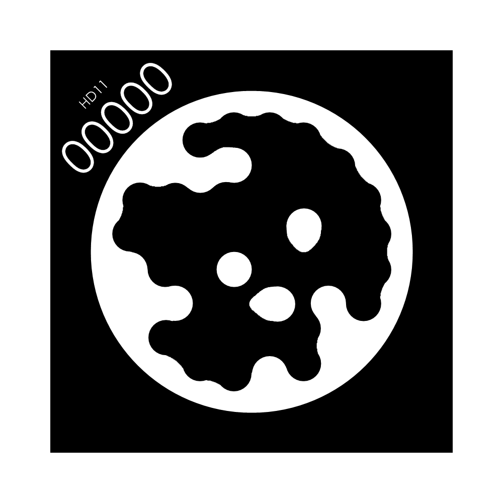

# STAG码跟踪案例

>> 将相机安装在机械臂的末端。 该功能使用 eye-in-hand 的方式。重新安装相机之后，需进行一次手眼标定。（注意：260、270设备不支持此功能）

系统开机后，会自动启动程序，该程序支持启动颜色识别、形状识别、特征点图像识别、AR二维码识别、YOLOv5 图像识别、AiKit_UI程序、手柄控制程序、myCobot自适应夹爪案例、myCobot五指灵巧手案例以及stag码跟踪案例。

>>注意：M5版本机器使用前需选择设备型号，PI版本则不需要。


根据终端信息提示，选择对应机械臂型号，如果是PI版本设备，则忽略此步骤。这里以280M5为例，输入1：


**按下数字0，启动stag码跟踪案例功能。首先机械臂会运动到观测点初始位置，然后Stag码木块与机械臂末端摄像头法兰保持30cm距离，机械臂开始进行跟踪运动。**


**演示视频:** 

<video id="my-video" class="video-js" controls preload="auto" width="100%"
poster="" data-setup='{"aspectRatio":"16:9"}'>
  <source src="../resources/5-BasicAlgorithmFunction/YOLORecognition.mp4"></video>

## Stag码

本文使用stag码用作二维码跟踪，建议使用彩印，黑白打印识别率较低。



下载地址：[Stag码下载](https://drive.google.com/drive/folders/0ByNTNYCAhWbILXd2SE5FY1c3WXM?resourcekey=0-nWeENtNZql2j9AF32Ud8sQ)

**注意：** stag码的左上角为编号，使用opencv的stag识别库可以识别该编号，你可以为不同编号设计不同的行为逻辑，比如00设为位置跟踪，01设为回到观测点。

## 手眼标定

### 2.1 手眼矩阵原理

**手眼标定是视觉跟踪必不可少的一环，其作用是求得机械臂坐标系（手）与相机坐标系（眼）之间的相对关系，我们把这种相对关系用一个4*4的手眼矩阵来表示，具体原理可以参考以下链接：** [手眼矩阵原理](https://blog.csdn.net/weixin_45844515/article/details/125571550)

### 2.2 手眼标定方法

>> 注意： 重新安装相机之后，需进行一次手眼标定。

将相机装配到机械臂上（一般装配在机械臂末端），连接需要控制的机械臂

将 `home/er/convenient_aikit/AiKit_280M5/scripts/camera_detect.py` 文件部分内容修改如下：

```python
if __name__ == "__main__":
    # Load camera configuration parameters
    camera_params = np.load("/home/er/convenient_aikit/AiKit_280M5/scripts/camera_params.npz")
    mtx, dist = camera_params["mtx"], camera_params["dist"]

    # Initialize the camera detector
    m = camera_detect(0, 32, mtx, dist)

    # Disable vision mode initially
    mc.set_vision_mode(0)

    # Uncomment the following lines to run specific functions
    # m.camera_open_loop()               # Open camera in a continuous loop
    # m.stag_identify_loop()             # Continuously detect STAG markers
    # m.stag_robot_identify_loop(mc)     # Continuously calculate robot coordinates based on STAG
    m.Eyes_in_hand_calibration(mc)     # Calibrate Eyes-in-Hand matrix
    # m.vision_trace(0, mc)              # Perform a one-time vision trace

    # Start continuous vision trace loop
    # m.vision_trace_loop(mc)
```

修改后保存，运行命令：

```bash
cd ~/convenient_aikit/AiKit_280M5/scripts/
python3 camera_detect.py
```

此时机械臂会先运动到观测姿态

```python
offset_j5 = -90
self.origin_mycbot_level = [-45, 5, -104, 14, 90 + offset_j5, 40]
ml.send_angles(self.origin_mycbot_level, 50)  # Move to observation point
```

**注意：** 用户可自定义修改观测点位，比如旋转6关节使相机处于更合适的位置。

1. 运动到观测姿态后，终端会弹出以下提示，将stag码置于相机视野内，输入任意键即可继续识别

```bash
make sure camera can observe the stag, enter any key quit
```

2. 若相机识别到stag码，则会自动进入下一步识别，机械臂移动并捕捉机械臂和相机的位置信息

```bash
Move the end of the robot arm to the calibration point, press any key to release servo
```

3. 贴紧后根据提示，输入任意键完成手眼标定

```bash
focus servo and get current coords
```

此时会打印EyesInHand_matrix信息，视为标定完成，生成"EyesInHand_matrix.json配置文件，标定成功后无需重复操作！
具体效果参考如下视频，效果与mycobot 280类似：

<video id="my-video" class="video-js" controls preload="auto" width="100%"
poster="" data-setup='{"aspectRatio":"16:9"}'>
  <source src="../resources/5-BasicAlgorithmFunction/mycobot_hand_vision.mp4"></video>

**注意：手眼标定可能会由于操作不当、机器虚位等原因出现误差，当视觉跟踪效果不好时，需要重新手眼标定**