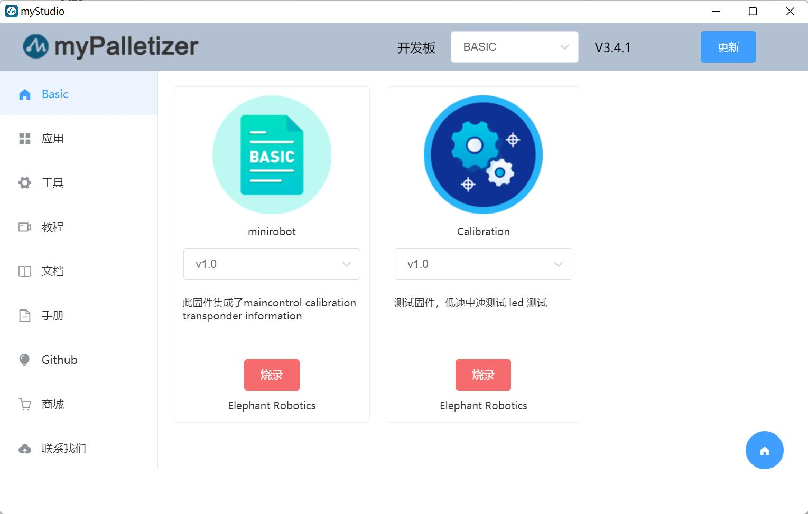

# 2 烧录与更新固件

**[myStudio视频教程](https://www.bilibili.com/video/BV1Qr4y1N7B5/)**

## 2.1 烧录M5Stack-Basic固件

> **注意：Pi系列机械臂无需烧录M5Stack-Basic固件。**

第一步: 与PC连接。M5Stack-Basic与PC连接方式如下图所示：

第二步：选择端口。连接之后，myStudio 的连接窗口的`USB端口`会显示出已连接的开发板（这里是以myPalletizer 260M5版本为例）：

第三步：点击`登录`->`M5Stack-basic`，即可烧录所需固件：

> **注意：**280 PI/Jetson nano/Arduino版本没有M5Stack-basic，因此连接到myStudio之后会显示“无数据”。

## 2.2 烧录 Atom 固件

第一步：与PC连接。用 USB 连接末端的Atom。

第二步：在`Board`一栏可以选择`ATOM`,侧边栏`Basic`就会出现 Atom 的固件。Atom 的固件就只有一个，点击烧入即可（下图以myCobot 280为例）。

