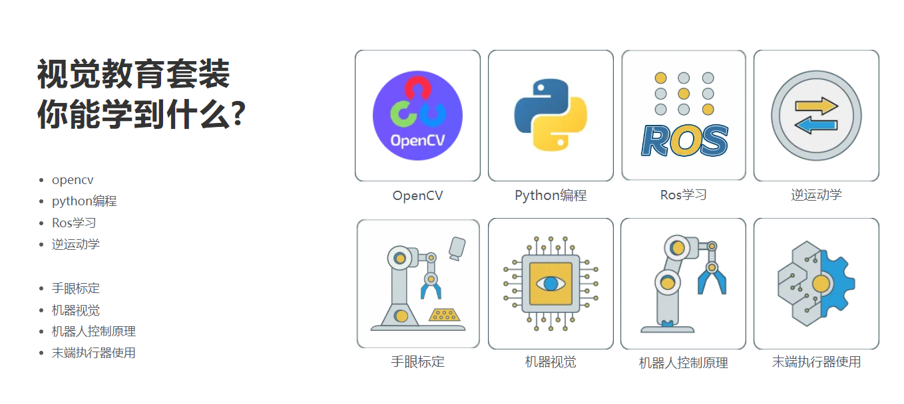
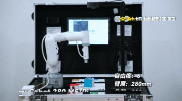

## 1.2 应用场景

便携式人工智能教育实训箱具备五大视觉算法与八大核心学习模块，支持一键启动、拖拽示教等多种交互方式，无需编程即可快速开展AI实践。配备多种扩展模块，适用于教学、实训、考核等场景，助力学生系统掌握AI与机器人技术全链路能力。

- 3分钟快速部署：

- 5大视觉算法：

- 8大学习点：

- 多种机械臂适配：

- 配备多种拓展模块：

---

[← 上一页](1.1-ProductIntroduction.md) | [下一章 →](../2-ProductFeature/README.md) 
