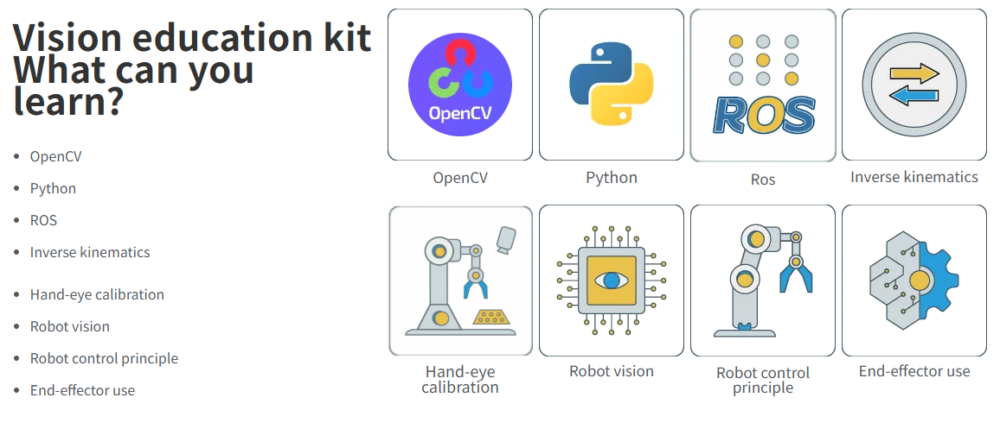
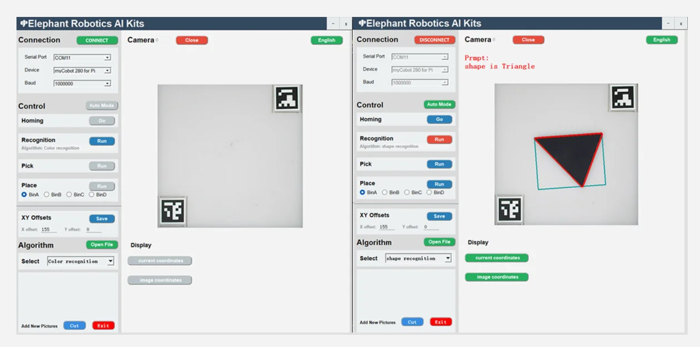

## Application Scenarios

This portable AI educational training box features five vision algorithms and eight core learning modules. It supports multiple interactive methods, including one-click start and drag-and-drop teaching, allowing for rapid AI practice without programming. Equipped with a variety of expansion modules, it's suitable for teaching, practical training, and assessment scenarios, helping students systematically master the full range of AI and robotics capabilities.

- 3-minute quick deployment:

- 5 major visual algorithms:

- 8 major learning points:

- Visual Software: Supports visual software operation, provides customized and simple operation methods, and quickly activates the AI ​​suite.

- Multiple robotic arm adaptation:

- Equipped with a variety of expansion modules:

---

[← Previous Page](1.1-ProductIntroduction.md) | [Next Chapter →](../2-ProductFeature/README.md) 
