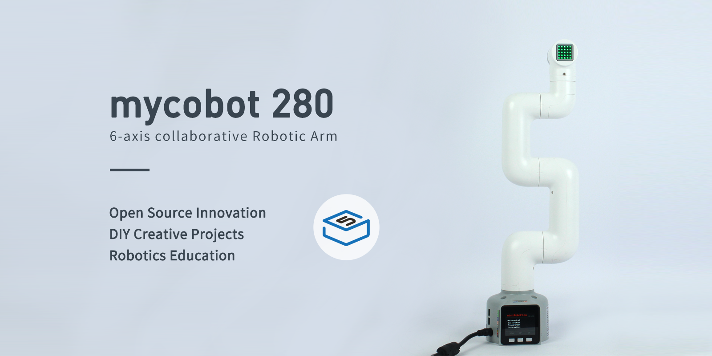

# Ai Portable Training Box - Version 280

>> (Host and accessories must be purchased separately)

| Parameter Category | Detailed Information |
|------------------|-----------------------------------------------------------------------------|
| Model | Luggage Case |
| Overall Dimensions | 640×420×285mm |
| Overall Weight | 11.2KG (excluding robotic arm) |
| Power Supply | 12V 5A |
| Camera Flange (Standard) | my Series Camera Module |
| Touch Screen | 10.1-inch Touch Screen (1920*1200) |
| Keyboard, Mouse, and Controller Combination | RK707 USB Connection (Single Wireless Version) |

## myCobot 280

<table>
<tr>
    <td> product </td>
    <td>picture</td>
    <td>Link</td>
</tr>
<tr>
    <td>myCobot 280 M5</td>
    <td> </td>
    <td><a href="https://docs.elephantrobotics.com/docs/mycobot_280_m5_en/">Introduction</a></td>
</tr>
<tr>
    <td>myCobot 280 PI</td>
    <td> </td>
    <td><a href="https://docs.elephantrobotics.com/docs/mycobot_280_pi_en/">Introduction</a></td>
</tr>
</table>

| Parameter Category | Details |
| :----------: | :---------: |
| Model | myCobot 280 for M5 |
| Degrees of Freedom | 6 |
| Payload | 250g |
| Working Radius | 280mm |
| Repeatability | ±0.5mm |
| Weight | 800g |
| Power Input | 12V, 5A |
| Operating Temperature | -5-45°C |
| Communication | Type-C |

| Parameter Category | Details |
| :----------: | :---------: |
| Model | myCobot 280 Raspberry Pi 2023 |
| Degrees of Freedom | 6 |
| Payload | 250g |
| Working Radius | 280mm |
| Repeatability | ±0.5mm |
| Weight | 800g |
| Power Input | 12V, 5A |
| Operating Temperature | -5-45°C |
| Communication | Type-C |

---

[← Previous Page](./README.md) | [Next Page →](./2.2-270_version.md)
