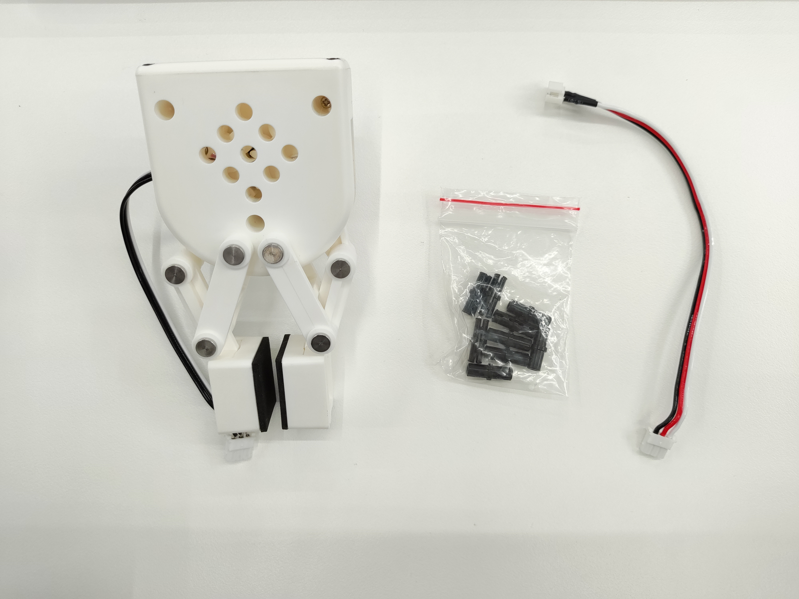

# 自适应夹爪

**产品图示**


**规格说明：**

| 名称         | myCobot 自适应夹爪                               |
| ------------ | ------------------------------------------------------------------------------------------ |
| 型号 model   | myCobot_gripperAg_white                                                                    |
| 工艺         | ABS 注塑                                                                                   |
| 颜色         | 白色                                                                                       |
| 夹持范围     | 20-45mm                                                                                    |
| 最大夹持力   | 150g                                                                                       |
| 重复精度     | 1mm                                                                                        |
| 使用寿命     | 一年                                                                                       |
| 驱动方式     | 电动 electric                                                                              |
| 传动方式     | 齿轮＋连杆                                                                                 |
| 尺寸         | 112×94×50mm                                                                                |
| 重量         | 110g                                                                                       |
| 固定方式     | 乐高连接件                                                                                 |
| 使用环境要求 | 常温常压                                                                                   |
| 控制接口     | 串口控制                                                                                   |
| 适用设备     | ER myCobot 280 系列 ，ER myPalletizer 260 系列， ER mechArm 270 系列 ，ER myBuddy 280 系列 |

**自适应夹爪：** 夹取物体使用

**简介**

- 夹爪是一种可以实现类似人手功能的机器人部件。其结构较复杂、抓取物体牢固、不易掉落、易操作的优点。夹爪套件包括夹爪配件和乐高科技件，通过可编程系统控制机械臂的末端执行器，实现物件的抓取、多点定位等功能。在所有的开发环境下都可以使用夹爪，如 ROS、Arduino、Roboflow 等。

**工作原理**

- 由电机驱动，夹爪的指面作直线往复运动来实现张开或闭合动作的，电动夹爪的加减速可控，对工件的冲击可以减至最小，定位点位可控，夹持可控。

**适用物体**

- 小方块
- 小球
- 长条物体

**安装使用**

- 检查配件包东西是否齐全：乐高连接件、带连接线的夹爪、连接线延长线
  

- 夹爪安装：

  - 结构安装：

    1. 将乐高连接件插入夹爪预留的插孔中，根据需要可以选择两个不同方向进行安装：

       > 
   

    2. 将插好连接件的夹爪对准机械臂末端插孔插入：

       > 

  - 电气连接：

    1. 将延长线与夹爪连接：
       > 
    2. 插入机械臂控制接口：
       >   

       >   

<br>

- 编程开发：

  > 使用 python 对夹爪进行编程开发

     - M5 版本：

     ```python
     from pymycobot import MyCobot280
     import time

     # 初始化一个MyCobot280对象
     mc = MyCobot280("COM3", 115200)

     # 以下三种方式均可控制夹爪打开-关闭-打开
     # 方式一：
     mc.set_gripper_state(0, 80)
     time.sleep(3)
     mc.set_gripper_state(1, 80)
     time.sleep(3)
     mc.set_gripper_state(0, 80)
     time.sleep(3)

     # 方式二：
     # mc.set_gripper_value(100, 80)
     # time.sleep(3)
     # mc.set_gripper_value(0, 80)
     # time.sleep(3)
     # mc.set_gripper_value(100, 80)
     # time.sleep(3)

     # 方式三：
     # mc.set_encoder(7, 2048)
     # time.sleep(3)
     # mc.set_encoder(7, 1500)
     # time.sleep(3)
     # mc.set_encoder(7, 2048)
     # time.sleep(3)
     ```

     - 280-Pi 版本：

     ```python
     from pymycobot import MyCobot280
     from pymycobot import PI_PORT, PI_BAUD  # 当使用树莓派版本的mycobot时，可以引用这两个变量进行MyCobot280初始化
     import time

     # 初始化一个MyCobot280对象
     mc = MyCobot280(PI_PORT, PI_BAUD)

     # 以下三种方式均可控制夹爪打开-关闭-打开
     # 方式一：
     mc.set_gripper_state(0, 80)
     time.sleep(3)
     mc.set_gripper_state(1, 80)
     time.sleep(3)
     mc.set_gripper_state(0, 80)
     time.sleep(3)

     # 方式二：
     # mc.set_gripper_value(100, 80)
     # time.sleep(3)
     # mc.set_gripper_value(0, 80)
     # time.sleep(3)
     # mc.set_gripper_value(100, 80)
     # time.sleep(3)

     # 方式三：
     # mc.set_encoder(7, 2048)
     # time.sleep(3)
     # mc.set_encoder(7, 1500)
     # time.sleep(3)
     # mc.set_encoder(7, 2048)
     # time.sleep(3)
     ```

    保存文件并关闭，返回命令行终端，输入：

     ```bash
     python grip.py
     ```

     可以看到夹爪打开-关闭-打开