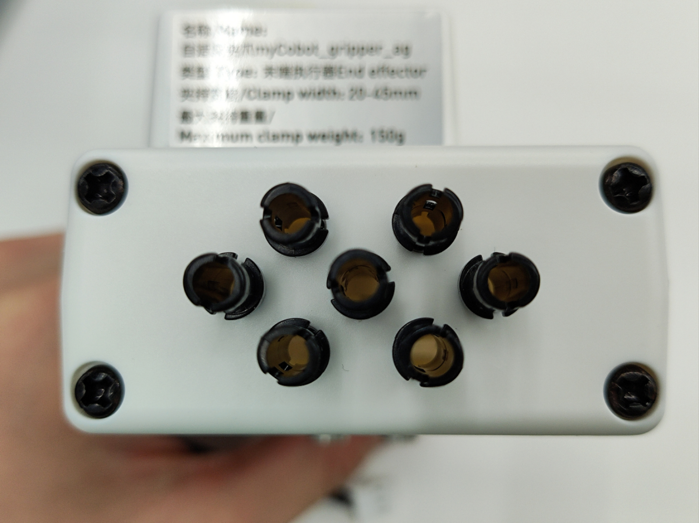
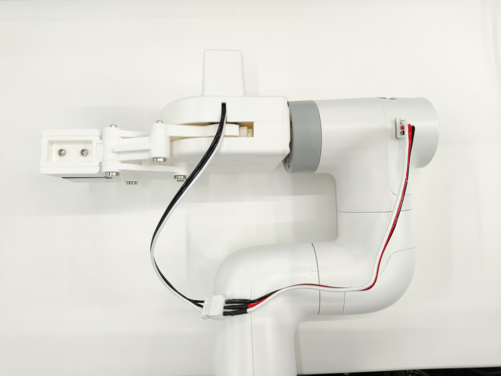

# Adaptive Gripper

**Product Image**


**Specifications:**

| Name | myCobot Adaptive Gripper |
| ------------ | ---------------------------------------------------------------------------------------------- |
| Model | myCobot_gripperAg_white |
| Process | ABS Injection Molding |
| Color | White |
| Gripping Range | 20-45mm |
| Maximum Gripping Force | 150g |
| Repeatability | 1mm |
| Service Life | One Year |
| Drive Mode | Electric |
| Transmission Mode | Gear + Connecting Rod |
| Dimensions | 112 × 94 × 50mm |
| Weight | 110g |
| Mounting Method | LEGO Connector |
| Operating Environment | Normal Temperature and Pressure |
| Control Interface | Serial Control |
| Applicable Devices | ER myCobot 280 Series, ER myPalletizer 260 Series, ER mechArm 270 Series, ER myBuddy 280 Series |

**Adaptive Gripper:** For gripping objects

**Introduction**

- A gripper is a robotic component that performs functions similar to a human hand. Its complex structure offers advantages such as a secure grip, resistance to drops, and ease of operation. The gripper kit includes the gripper components and LEGO technology. A programmable system controls the robotic arm's end effector, enabling functions such as gripping and multi-point positioning. The gripper can be used in all development environments, including ROS, Arduino, and Roboflow.

**Operating Principle**

- Driven by a motor, the gripper's finger surface moves in a linear reciprocating motion to open and close. The electric gripper's acceleration and deceleration are controllable, minimizing impact on the workpiece. The positioning point and gripping position are controllable.

**Applicable Objects**

- Small cubes
- Small balls
- Long objects

**Installation and Usage**

- Check that the accessories package contains the following: LEGO connector, gripper with cable, and extension cable.

- Gripper Installation:

  - Structural Installation:

    1. Insert the LEGO connector into the pre-installed socket on the gripper. You can choose to install it in two different orientations depending on your needs:

    > 

    2. Align the gripper with the connector inserted into the socket on the end of the robot arm and insert it:

    > 

  - Electrical Connections:

    1. Connect the extension cable to the gripper:

    
    2. Inserting the Robot Arm Control Interface:
    > 

    > 

    <br>

- Programming Development:

> Using Python to Program the Gripper

  - M5 Version:

     ```python
     from pymycobot import MyCobot280
     import time

     # Initialize a MyCobot280 object
     mc = MyCobot280("COM3", 115200)

     # The following three methods can all control the gripper's open-close-open state.
     # Method 1:
     mc.set_gripper_state(0, 80)
     time.sleep(3)
     mc.set_gripper_state(1, 80)
     time.sleep(3)
     mc.set_gripper_state(0, 80)
     time.sleep(3)

     # Method 2:
     # mc.set_gripper_value(100, 80)
     # time.sleep(3)
     # mc.set_gripper_value(0, 80)
     # time.sleep(3)
     # mc.set_gripper_value(100, 80)
     # time.sleep(3)

     # Method 3:
     # mc.set_encoder(7, 2048)
     # time.sleep(3)
     # mc.set_encoder(7, 1500)
     # time.sleep(3)
     # mc.set_encoder(7, 2048)
     # time.sleep(3)
     ```

     - 280-Pi version:

     ```python
     from pymycobot import MyCobot280
     from pymycobot import PI_PORT, PI_BAUD  # When using the Raspberry Pi version of mycobot, you can reference these two variables to initialize MyCobot280
     import time

     # Initialize a MyCobot280 object
     mc = MyCobot280(PI_PORT, PI_BAUD)

     # The following three methods can all control the gripper's open-close-open state.
     # Method 1:
     mc.set_gripper_state(0, 80)
     time.sleep(3)
     mc.set_gripper_state(1, 80)
     time.sleep(3)
     mc.set_gripper_state(0, 80)
     time.sleep(3)

     # Method 2:
     # mc.set_gripper_value(100, 80)
     # time.sleep(3)
     # mc.set_gripper_value(0, 80)
     # time.sleep(3)
     # mc.set_gripper_value(100, 80)
     # time.sleep(3)

     # Method 3:
     # mc.set_encoder(7, 2048)
     # time.sleep(3)
     # mc.set_encoder(7, 1500)
     # time.sleep(3)
     # mc.set_encoder(7, 2048)
     # time.sleep(3)
     ```

    Save the file and close it, then return to the command line terminal and enter:

     ```bash
     python grip.py
     ```

     You can see the jaws open-close-open