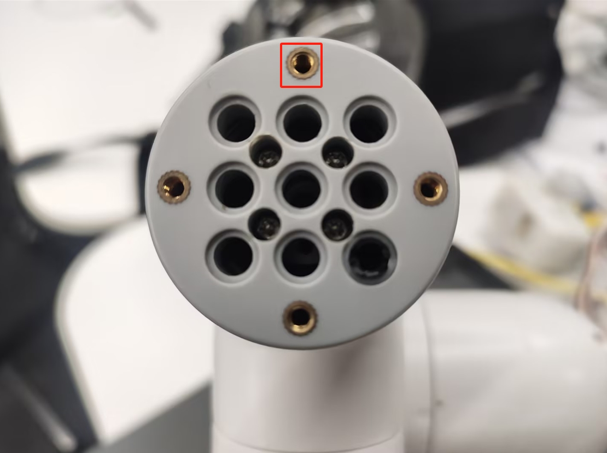

# Dexterous Hand

**Product Image**


**Specifications:**

| Name | **mycobot Dexterous Gripper** |
| ------------ | ------------------------------------------------------------ |
| Model | Dexterous Hand |
| Material | 3D Printed |
| Dimensions | 112 × 94 × 50 mm |
| Color | White |
| Transmission Method | Gear + Connecting Rod |
| Clamping Range | 20-45 mm |
| Maximum Clamping Force | 100 g |
| Fixing Method | Screw Fixing |
| Operating Environment | Normal Temperature and Pressure |
| Control Interface | Serial Control |
| Applicable Devices | ER myCobot 280 Series, ER mechArm 270 Series, ER myPalletizer 260 Series |

**Dexterous Hand:** Used for gripping objects

**Introduction**

- A gripper is a robotic component that performs functions similar to a human hand. Its complex structure offers advantages such as a secure grip, resistance to drops, and ease of operation. The gripper kit includes the gripper components and LEGO technology. A programmable system controls the end effector of the robotic arm, enabling functions such as gripping and multi-point positioning.

**Operating Principle**
- Driven by a motor, the gripper's finger surfaces move in a linear reciprocating motion to open and close. The electric gripper's acceleration and deceleration are controllable, minimizing impact on the workpiece. The positioning points and gripping position are controllable.

**Applicable Objects**

- Small cubes

- Small balls

- Long objects

## Gripper Installation

- Insert the LEGO connector into the gripper hole:




**Electrical Connection**

- Insert the gripper with the connector installed into the end cap of the robotic arm.


Python Programming Control

+ M5 Version

```python
 from pymycobot.mycobot280 import MyCobot280
 import time

 # Initialize a MyCobot280 object
 mc = MyCobot280("COM3", 115200)

 mc.set_encoder(7,2048,40)  # Open
 time.sleep(2)
 mc.set_encoder(7,2300,40)  # Hold tight
 time.sleep(2)
 mc.set_encoder(7,2048,40)  # Hold tight
```

+ Pi version

```python
from pymycobot.mycobot280 import MyCobot280
from pymycobot import PI_PORT, PI_BAUD  # When using the Raspberry Pi version of mycobot, you can reference these two variables to initialize MyCobot
import time
  
# Initialize a MyCobot280 object
mc = MyCobot280(PI_PORT, PI_BAUD)
mc.set_encoder(7,2048,40)  # Open
time.sleep(2)
mc.set_encoder(7,2300,40)  # Hold tight
time.sleep(2)
mc.set_encoder(7,2048,40)  # Hold tight
```