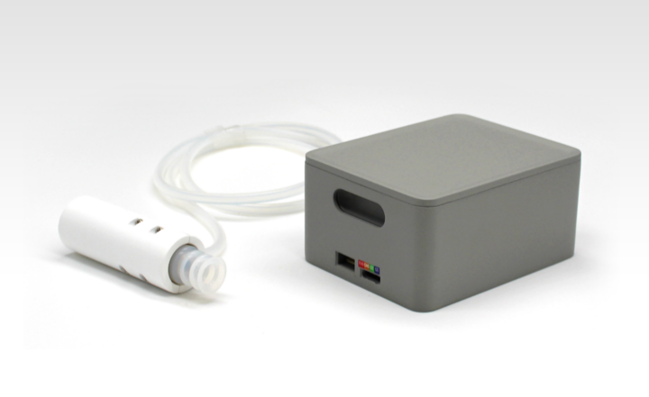
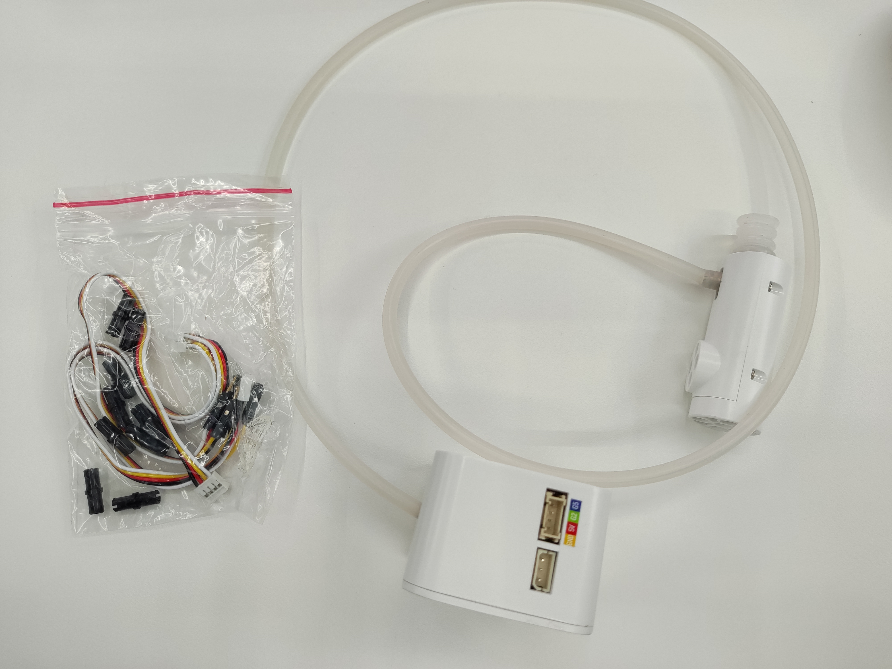
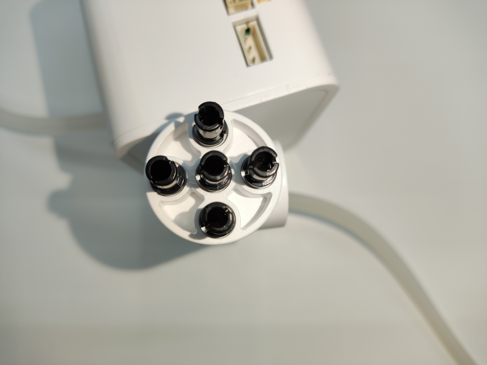
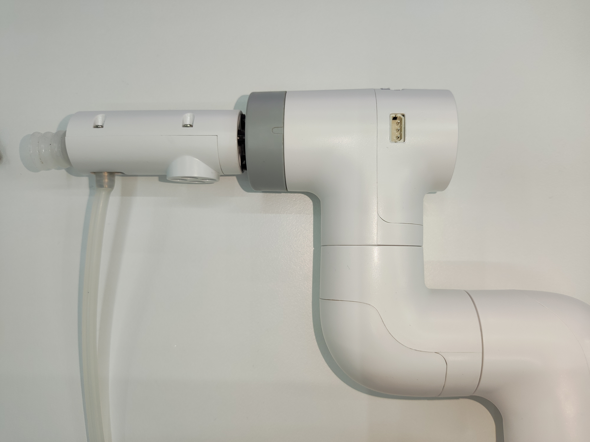
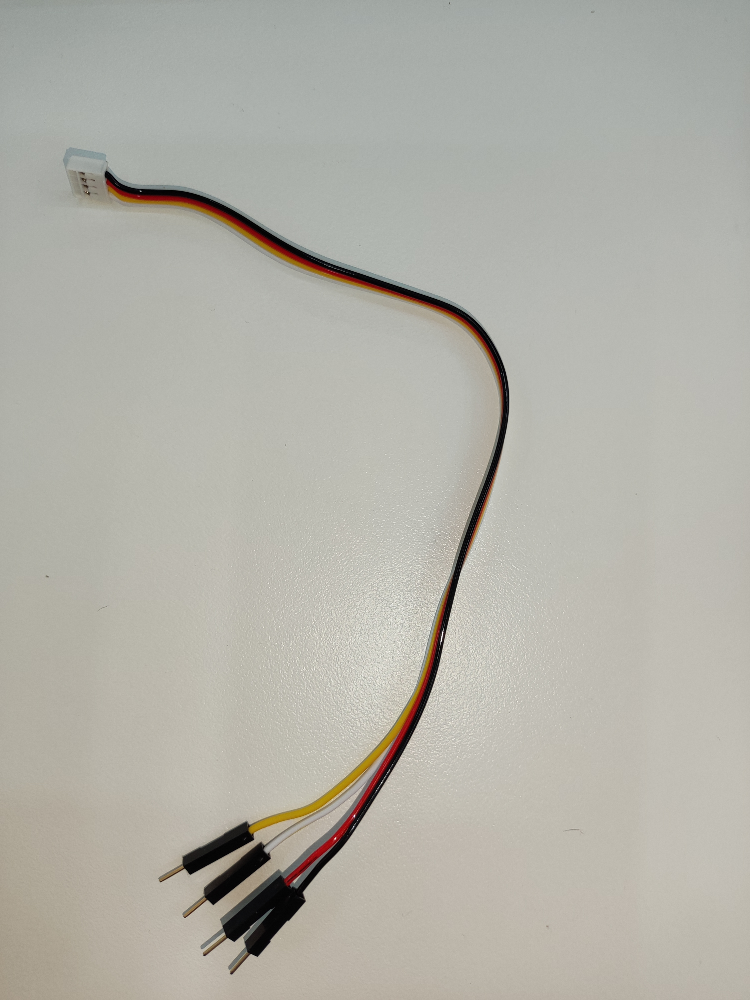
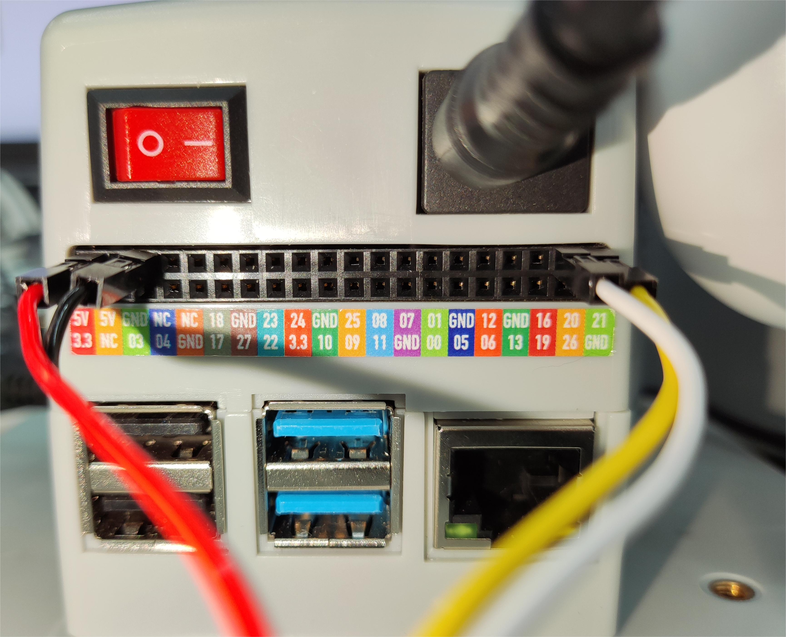

# Vertical Suction Pump V2.0

**Product Image**

> 

**Specifications**

| Name | myCobot Vertical Suction Pump V2.0 |
| ------------ | ---------------------------------------------------------------------------------------------- |
| Model | myCobot_suctionPump_V2.0_grey |
| Material | ABS Injection Molding |
| Color | White |
| Dimensions | Pump Box: 72x52x37mm Pump Tip: 63x24.5x26.7mm |
| Number of Suction Cups | 1 |
| Suction Cup Size | Diameter 20mm |
| Suction Weight | 150g |
| Power Source | Pump Box |
| Service Life | One Year |
| Mounting Method | LEGO Connector |
| Control Interface | IO Control |
| Operating Environment Requirements | Normal Temperature and Pressure |
| Applicable Equipment | ER myCobot 280 Series, ER myPalletizer 260 Series, ER mechArm 270 Series, ER myBuddy 280 Series |

**Suction Pump**: Used for suctioning objects

**Introduction**

- The suction pump, also known as a vacuum suction pump, features an inlet and outlet nozzle, an outlet nozzle, and a simple structure, compact size, ease of use, low noise, and excellent self-priming capability. The suction pump kit acts as the end effector of the robotic arm to perform the suctioning function.

- Suction Pump Accessories: Power Cord x1, DuPont Cables x10, One-Input Two-Output Connecting Cable x1, Several Lego Technic Pieces

**Working Principle**

- When suctioning an object: The pump activates to suck air from the object and then stops, preventing air leakage.
- When releasing an object: The electronic valve activates, the air release valve opens, and air enters the vacuum cup and releases the object.

**Applicable Objects**

- Paper/Plastic Sheets
- Flat, Smooth Objects
- Cards, etc.

> 

**Installation and Use**

- Check that the accessories package contains all the necessary items: LEGO connectors, DuPont cables, and a dual-head suction pump.

> 

- Dual-head suction pump installation:

Structural installation:

Insert the LEGO connectors into the designated sockets on the suction pump.

> 

  Align the suction pump with the connector plugged in with the socket at the end of the robotic arm and insert it:

> 

  - Electrical connections:
  
    Select a male-female Dupont cable and insert the female end into the marked pin socket on the suction pump box:
  
    > Male-female DuPont wire:
    > 
    > Note the correspondence between the DuPont wire colors and pins in the figure:
    > 
  
    1. Insert the male connector into the pins on the base of the robotic arm according to the given correspondence:
       
    
       > The left side is the suction pump pin, and the right side is the robotic arm pin
       > GND -> GND  
       > 5V -> 5V  
       > G2 -> 21  
       > G5 -> 20
  
  - Programming Development:

> Using Python to program a suction pump

> The code is as follows:

- 280-M5 version:    
    ```python
    from pymycobot.mycobot280 import MyCobot280
    import time
    
    # Initialize a MyCobot280 object
    mc = MyCobot280("COM3", 115200)
    
    # Turn on the suction pump
    def pump_on():
        # Open the solenoid valve
        mc.set_basic_output(5, 0)
        time.sleep(0.05)
    
    # Stop priming the pump
    def pump_off():
        # Close the solenoid valve
        mc.set_basic_output(5, 1)
        time.sleep(0.05)
        # The deflation valve starts working
        mc.set_basic_output(2, 0)
        time.sleep(1)
        mc.set_basic_output(2, 1)
        time.sleep(0.05)
    
    pump_off()
    time.sleep(3)
    pump_on()
    time.sleep(3)
    pump_off()
    time.sleep(3)
    
    GPIO.cleanup() # release pin channel
    ```
    
    - 280-Pi 版本：
    
    ```python
    from pymycobot.mycobot280 import MyCobot280
    from pymycobot import PI_PORT, PI_BAUD  # When using the Raspberry Pi version of mycobot, you can reference these two variables to initialize MyCobot
    import time
    import RPi.GPIO as GPIO
    
    # Initialize a MyCobot280 object
    mc = MyCobot280(PI_PORT, PI_BAUD)
    
    # Initialization
    GPIO.setmode(GPIO.BCM)
    # Pins 20/21 control the solenoid valve and the bleed valve, respectively
    GPIO.setup(20, GPIO.OUT)
    GPIO.setup(21, GPIO.OUT)
    
    # Turn on the suction pump
    def pump_on():
        # Open the solenoid valve
        GPIO.output(20，0)
    
    # Stop priming the pump
    def pump_off():
        # Close the solenoid valve
        GPIO.output(20，1)
        time.sleep(0.05)
        # Open the vent valve
        GPIO.output(21，0)
        time.sleep(1)
        GPIO.output(21，1)
        time.sleep(0.05)
    
    pump_off()
    time.sleep(3)
    pump_on()
    time.sleep(3)
    pump_off()
    time.sleep(3)
    
    GPIO.cleanup() # release pin channel
    ```
