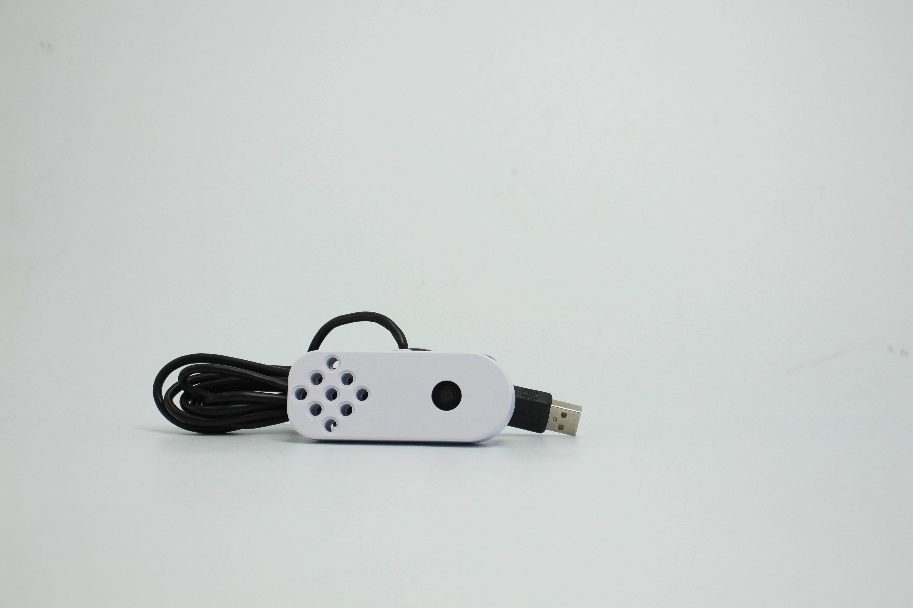
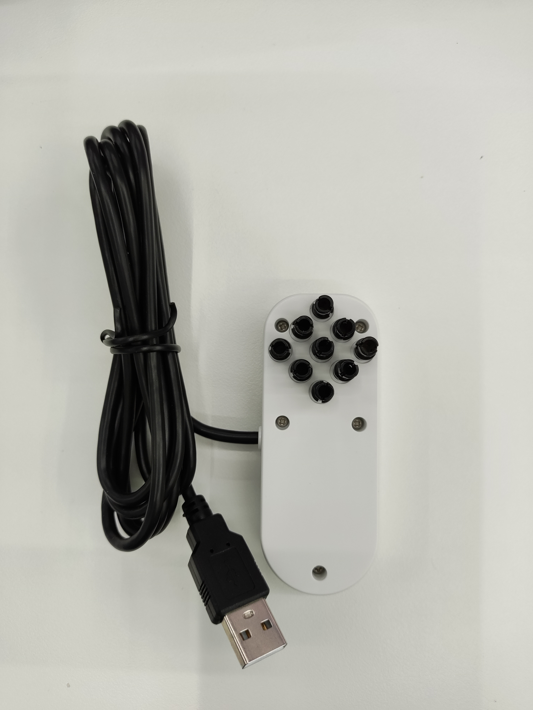
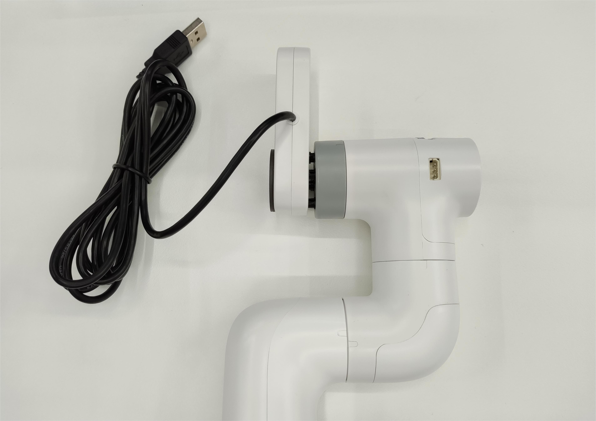
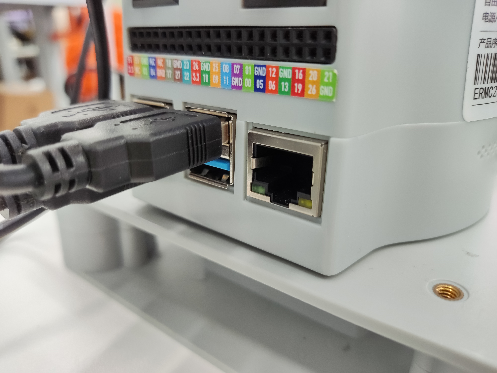

# myCobot Camera Module v2.0

**Product Image**

> 

**Specifications:**

| Name | myCobot Camera Module v2.0 |
| ---------------- | ------------------------------------------------------------------------------------------ |
| Model | myCobot_cameraHolder_J6 |
| Color | White (default) |
| Material | ABS injection molding |
| Dimensions | 83*64*16 |
| USB Protocol | USB2.0 HS/FS |
| Lens Focal Length | Standard 1.7mm |
| Field of View | Approximately 60° |
| Supported Systems | Win7/8/10, Linux, MAC |
| Supported Resolutions | 2592x1944, 2560x1440, 2048x1536, 1920x1080, 1280x72, 1024x768, 800x600, 640x480, 640x360, 352x288, 320x240, 176x144 |
| Service Life | Two Years |
| Mounting Method | LEGO Connectors |
| Operating Environment | Normal Temperature and Pressure |
| Supported Devices | ER myCobot 280 Series, ER myPalletizer 260 Series, ER mechArm 270 Series, ER myBuddy 280 Series |

**Camera Flange:** Machine Vision

**Introduction**

- This USB HD camera can be used with suction pumps, adaptive grippers, and AI kits, enabling precise positioning and calibration with your fingertip.

## Installation and Usage

- Check if the accessories package is complete: Lego connector, camera module with USB cable
  

- Camera installation:

  **Structural installation:**

  Insert the Lego connector into the reserved socket of the camera module:
  

  Align the camera module with the connector plugged in with the socket at the end of the robotic arm and insert it:
  

  **Electrical connections:**

  Plug the USB cable into the dock USB port:
  
  
## Programming Development:

> The code is as follows:

```python
python
import cv2
import numpy as np

cap = cv2.VideoCapture(0) # "0", determined by the camera device number found

while(True):
    ret, frame = cap.read()

    # gray = cv2.cvtColor(frame, cv2.COLOR_BGR2GRAY)

    cv2.show('frame', frame)
    if cv2.waitKey(1) & 0xFF == ord('q'):
        break

cap.release()
cv2.destroyAllWindows()

```