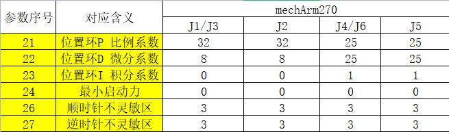

# User Notice

## 3.1 The target of reading the book

The book is designed to help you reach the following targets.

> Main targets

-   Understand the basic use of mechanisms, electronics and software
    related to robot arms.
-   Understand the basic principle, joints, coordinates, terms, control
    and other information of the robot arm. Able to do simple forward
    and inverse kinematics calculations.
-   Understand the basic operations of API-controlled robot arms and the
    robot arms controlled by myBlockly graphical programing language.

> Extended targets

-   Understand the image recognition algorithms related to machine
    vision.
-   Understand the building of robot vision scenes and the methods and
    strategies of coordination between vision and robot arm.
-   Grasp all skills of artificial intelligence (AI) packages.

## 3.2 Division of your background

You should read the book based on your background. We divide the
background and related knowledge into three degrees:

Degree   |Background  |Skills  |Estimated time of learning|Recommended platform
 ---- | ----  |----  |----  |----  
**Beginner**|Specialty related to information, electronics and automation|Understand a kind of programming language and the basic knowledge related to electronics| 100 hours | myBlockly
**Advanced**|Understand Arduino or similar hardwares, servo and programming, IO interface, etc		|Able to debug API and interfaces, and understand communication| 50 hours | Arduino
**Professional**|The readers used at least one industrial or consumer robot arms, and have the ability to develop hardware and software	|Understand the Cartesian coordinate system, joint control, and basic use of robots| 30 hours| Random

## 3.3 Learning Steps and Time

No.|Target knowledge points |Theory|Practice |Estimated hours of learning  
 ---- | ---- |---- |----  |----  
1 |**Quick unpacking**  		|1 Drag teaching 		|1. The accessories for myCobot  2. drive the robot to perform drag teaching|1 hour
2 |**Background knowledge learning** 	|1. Use background of industrial robots;   2. coordinate and space learning, and Cartesian 3D coordinate and rotation, xyz;   3. joint and coordinate control of industrial robots|1. Joint control and recurrence of robot joints  2. speed control of robots  3. control and cycle of robot coordinate points|5 hours  	
3 |**Hardware learning**  	|1. Principles and operations of embedded electronics  2. the principle and knowledge of servo and motor  3. actuator learning|1. Basic/atom control and driving  2. driving and motion of servo  3. robot accessory learning	|5 hours 	
4 |**Software and firmware and their updating**  	|1. Identify different software platforms and their use  2. firmware loading and adaptation principle|1. Select the developing platform suitable for you  2. load and update the corresponding firmware. |2 hours   
5 |**Building of software development environment** 	|1. Build Arduino platform  2. load and update of Arduino library file  3. understand serial communication|1. Familiar with Arduino platform  2. load a library  3. operate and run the first line of codes |2 hours   
6 |**Learning and development of robot library**  |1. Basic communication and operation types of robots  2. common operating methods of robots  3. control of direction and coordinate modes |1. Communicate with the robot  2. control the robot to move  3. operate the IO interface, gripper, etc. of the robot;	|5 hours   
7 |**myBlockly operation robot arm**  |1. Understand the basic architecture and relation of graphical programing language interfaces: sensor, actuator and procedure  2. variable, cycle and judgment  3. control method of robot arm|1. Display different fonts in the basic  2. make the robot arm move to different positions using three buttons of the basic  3. control the robot arm to make it move to several positions circularly|10 hours  
8 |**The use of roboFlow**  	|1. Learn the industrial operating systems commonly used for robots  2. learn the common modules for roboFlow: point, quick movement, IO control and output  3. learn the advanced modules of roboFlow: cycle, judgment, and pallet program  		|1. Control the movement of the robot arm  2. basic control of IO input and output  3. cycle control and judgmen|5 hours   
9 |**Algorithms related to image recognition**  |1. Common color recognition methods and strategies  2. common shape recognition methods and strategies  3. common area recognition methods and strategies |1. Building of a ROS environment  2. reading of different colors  3. recognition of different shapes |20 hours 
10 |**Vision and the joint debugging of the robot** |1. Connect the world with a camera coordinate system  2. QR code image calibration  3. movement and correction 		|1. Operate the robot arm to the camera coordinate system  2. the robot arm moves in the camera coordinate system  3. recalibrate and set |10 hours  
11 |**Artificial intelligence (AI) package** 		|1. Flow chart learning and making  2. electrical connection diagram learning and making   3. operation strategies such as image recognition and classification, etc  		|1. Sensor connection  2. gripper actuator connection and driving  3. robot arm driving and visual joint debugging |20 hours  

---

## 3.4 Additional problems

If the above learning contents cannot meet your actual use needs, you
can contact **Elephant Robotics helper** for further communication. We
provide customized services for software and hardware, and the service
fee is based on the **actual cost**.

## 3.5 After-Sales FQA

### 3.5.1 Software Related

#### 1 关于python

**Q: What do the various parameters in the send_coords([x,y,z,rx,ry,rz], speed, 1) API mean? What Euler angles do rx, ry, and rz correspond to? What is the rotation order for Euler angles? What is the range of values ​​for each parameter?**

- A: The parameters in the first array are the end-of-arm coordinates, speed is the speed, and the last parameter is the motion mode. rx, ry, and rz should correspond to rpy, which corresponds to roll, pitch, and yaw, respectively. The order of Euler angles is zyx, where zyx is the local coordinate. The range of X, Y, and Z values ​​is -300 to 300.00 (the range is undefined; if it exceeds the range, the error "inverse kinematics no solution" will be displayed). The range of rx, ry, and rz values ​​is -180 to 180.

**Q: Are there example tutorials for the Python API?**

- A: A demo is currently available. The test code is in the Test folder on GitHub; you can execute it in a terminal. https://github.com/elephantrobotics/pymycobot/tree/main/demo

**Q: How do I run the Python drag-to-teach demo for the mycobot280-Pi?**

- A: Run it in the terminal, and enter a baud rate of 1000000.

**Q: Why is there an error in the Python zero-position calibration demo for the mycobot280-Pi?**

- A: The Atom firmware has not been burned. Please burn the Atom firmware first and then run the program.

**Q: Are the Python APIs the same for different robot arm versions?**

- A: The APIs are the same.

#### 2 About ROS

**Q: How do I run ROS on a microcontroller-based robot arm and a microprocessor-based robot arm?**

- A: The microcontroller-based robot arm is currently running on Ubuntu. You need to download a virtual machine to create a virtual environment and install the Ubuntu system in the virtual environment to run ROS. You can also develop your own ROS. The microprocessor-based robot arm comes with a built-in ROS environment and can be used directly.

**Q: Can a microprocessor-based robotic arm be connected to a PC to use ROS and MoveIT?**

- A: Current open-source documentation doesn't support direct communication control. This can be achieved by modifying existing node files using ROS + sockets.

**Q: Can you provide the RVIZ model files and programming examples?**

- A: They are available on our GitHub repository: https://github.com/elephantrobotics/mycobot_ros

**Q: Why does the error "Permission denied: '/dev/ttyUSB0'" appear when launching the RVIZ model file using ROS?**

- A: This is because the serial port permissions are not granted. You should enter "sudo chmod 777 port name" in the terminal.

**Q: Why does the error "init() takes exactly 2 arguments (3 given)" appear when running the slider control and model following commands in ROS?**

- A: The pymycobot library has not been installed and started.

**Q: Why do the robotic arm angles and model angles differ after opening the RVIZ model using ROS?**
- A: The robot's zero position is likely out of calibration. Calibration is required.

#### 3 About myStudio

**Q: What is myStudio?**

- A: It's our company's proprietary software. It's a tool for flashing or modifying the firmware for our existing robot arms.

**Q: Is there any difference in the firmware used for the MyCobot 320 M5-2020 and 2022 models?**

- A: The requirements for the old 320 firmware are as follows: M5 version: minirobot 1.0 + atommain 4.2; PI version: Ubuntu 18.04 + atommain 4.1; The requirements for the new 320 firmware are as follows: M5 version: minirobot 2.1 + picomain 1.0 + atommain 5.0; PI version: Ubuntu 18.04 + picomain 1.0 + atommain 5.0; This firmware combination is up to mystudio version 4.3.1.

**Q: Why doesn't the ATOM terminal work properly after I flashed the firmware to it?**

- A: The ATOM terminal firmware must use our factory firmware. Other unofficial firmware cannot be changed during use. If other firmware is accidentally flashed to the device, you can use the "myCobot Firmware Flasher" to flash the ATOM terminal by selecting the ATOM terminal, then the serial port, and then the ATOMMAIN firmware.

**Q: Can the drag-to-teach feature in the firmware record gripper movements?**

- A: Currently, it's not possible to use drag-to-teach to record gripper movements because the gripper belongs to joint number 7. Our drag-to-teach feature can only record and play movements for joints numbers 1-6.

**Q: Why can't I use drag-to-teach after flashing the minirobot firmware?**

- A: First, check whether both the M5Stack-basic and atom firmware have been flashed, whether the flashed firmware meets the requirements, and whether the flashed firmware is the latest version.
- We recommend flashing the minirobot firmware to v2.1 and the atommain firmware to v4.1 or later (this requires mystudio v4.3.1 or later).

**Q: What should I do if mystudio doesn't recognize the mycobot serial port?**

- A: If your computer doesn't recognize the connected robotic arm, please install the serial port driver first.
- Also, please note that Raspberry Pi, Arduino, and Jetson Nano series robotic arms cannot be connected to a laptop using a data cable. Firmware flashing requires using mystudio within the built-in operating system.

**Q: Can I save the trajectory recorded during drag-teaching to a memory card?**

- A: Currently, it is not possible to save to a memory card. Furthermore, drag-teaching can only save one path at a time; the next recording will overwrite the previous one.

### 3.5.2 Hardware

#### 1 About the Structure

**Q: How do I fix the robotic arm's shaking problem?**

- A: Open mystudio and flash the latest version of atommain firmware to the robotic arm's ATOM. Then, update the pymycobot version (press Win+R and enter cmd to open the terminal). Use pip to update pymycobot (enter pip install pymycobot --upgrade --user and press Enter). Finally, find the pid_read_write.py file on GitHub, download it, and save it to your computer or Raspberry Pi. Follow the instructions in the code to modify each parameter configuration corresponding to the servo number. The parameter numbers correspond to the numbers shown in the image. After making changes, run the program.
- 
- 
- 
- 
- 

Note: All joint parameters are different for each robotic arm model. You'll need to compare and modify them based on the corresponding robotic arm model in the figure below.

The pid_read_write.py file is available on GitHub: https://github.com/elephantrobotics/pymycobot/tree/main/demo

**Q: What are the joint limits on myCobot?**

- A: The first and fifth axes have limits. The first axis can rotate approximately 160° clockwise and 160° counterclockwise. The fifth axis can rotate approximately 160° clockwise and counterclockwise.
**Note**: When rotating the robotic arm, rotate it gently and at a small angle. Do not force it further after reaching the limit.

**Q: How are the six servos controlled?**

- A: The servos are controlled by the atom on top.

**Q: What is the role of the atom in the robotic arm?**

- A: The atom primarily controls the kinematic algorithms of the robotic arm, including forward and inverse kinematics, solution selection, acceleration and deceleration, speed synchronization, multi-power interpolation, coordinate transformation, and other functions, as well as the required real-time control and multithreading. The relevant Atom software is not currently open source.

**Q: Why is there no display on the HDMI port of my microprocessor-based robotic arm? Do I need to download a serial port driver?**

- A: Check that the wiring is correct and the power switch is on. Try replacing the HDMI port. There are two HDMI ports on the robotic arm. Firmly plug the port firmly into the port. You don't need to download the serial port driver.
- Another possibility is that you may have powered on the robotic arm before connecting the HDMI cable. This can also result in no input signal on the monitor. You need to fully connect the HDMI cable before connecting the adapter (or turn on the power switch after connecting the adapter) while the robotic arm is powered off.

**Q: What communication interfaces do different versions of the robotic arm support?**

- A: Microprocessor-based robotic arms support TCP socket communication; microcontroller-based robotic arms can use USB-to-serial communication.

**Q: Why does the motor automatically power off during use?**

- A: The motor overheated after prolonged use. This is normal. Wait a few minutes before resuming use.

**Q: Does the robotic arm support Android development?**

- A: We currently don't have a direct Android development environment, so you'll need to develop your own. We provide serial port protocols, and serial port development is possible.

**Q: What is the function of the Raspberry Pi's built-in USB port?**

- A: The Raspberry Pi 4B has a built-in USB port that can power the Raspberry Pi. It currently has no other special function and cannot be used as a communication port to connect to a laptop or PC.
  
#### 2 About Parameters

**Q: What is the unit of speed for the robot arm?**

- A: The operating speed is 180 degrees/second.

**Q: What is the communication frequency for the mycobot280-M5?**

- A: 10-20 Hz.

#### 3 About the End Gripper

**Q: Can the adaptive gripper not completely close?**

- A: The gripper itself has a certain gap, so it is not completely closed. You can adjust this by increasing the thickness of the spacer between them.

**Q: What communication method does the mycobot280 adaptive gripper use?**

- A: The mycobot280 adaptive gripper uses TTL communication.

**Q: What communication method does the mycobot320 end-user provide?**

- A: The mycobot320 end-user provides a 485 communication interface.

**Q: How do I attach a USB camera to the end-user arm?**

- A: A flange is required, which you can purchase independently.

### 3.5.4 After-sales contact information

---

> Our working hours are China business days, 9:30 am to 7:00 pm Beijing time.

  - If you have any further questions, please contact us using the following methods.

[E-mail](support@elephantrobotics.com) :

<pre>
<code class="copyable">
support@elephantrobotics.com
</code>
</pre>
  - If you have any purchasing intentions or any parameter questions, please send an email to this mailbox. 

[E-mail](sales@elephantrobotics.com) :

<pre>
<code class="copyable">
sales@elephantrobotics.com
</code>
</pre>

  - If you encounter any problems while using this product, please read Chapter 9 of the manual first. If the problems listed cannot help you solve them and you have more after-sales questions, please send an email to this email address.

[E-mail](support@elephantrobotics.com) :

<pre>
<code class="copyable">
support@elephantrobotics.com
</code>
</pre>

We will respond within 1-2 business days.

WeChat:
We only provide one-on-one support for mycobot product purchases made through WeChat.

---

[← Previous Chapter](../2-ProductFeature/README.md) | [Next Chapter →](../4-FirstInstallAndUse/README.md)

