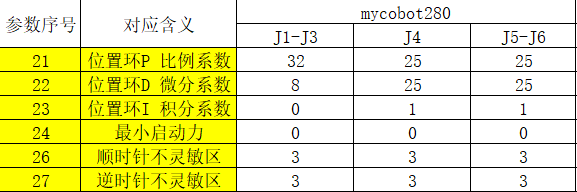

# 用户须知

## 3.1 本书阅读目标
本书的设计目标是通过阅读本书，您可以
> 主要目标

- 了解机械臂相关的机械、电子、软件的基本使用。
- 了解机械臂的基本原理，关节，坐标，术语，控制等。会进行简单的正逆运动学计算。
- 了解API控制机械臂与myBlockly图形化编程语言控制机械臂的基本操作。

> 扩展目标

- 了解机器视觉相关的图像识别算法。
- 了解机器人视觉场景的搭建与视觉与机械臂的配合方法与策略。
- 具备完成**人工智能**套装的所有技能。

---

## 3.2 您的背景划分
本书的阅读需要根据您的实际背景来进行阅读，我们将背景与相关知识划分成三个不同程度：

程度   |背景  |具备技能  |预计学习时间|建议开发平台
 ---- | ----  |----  |----  |----  
**入门**|信息，电子，机械，自动化相关专业	|了解一种编程语言 了解电子相关基础知识| 100小时 | myBlockly
**高级**|了解Arduino或类似硬件产品； 了解舵机、编程； 了解IO接口等		|会调试API，调试接口，了解通信| 50小时 | Arduino
**专业**|曾使用过至少1种工业或消费类机械臂； 具备硬件与软件开发能力	|了解机械臂笛卡尔坐标 了解关节控制 了解机器人的基本使用| 30小时| 任意

---

## 3.3 学习步骤与时间

序号|目标知识点 |理论|实践 |预计学时  
 ---- | ---- |---- |----  |----  
1 |**快速开箱**  		|1 拖动试教 		|1 myCobot机器人所包括配件   2 驱动机器人进行拖动试教|1小时  	
2 |**背景-知识学习** 	|1 工业机器人使用背景  2  坐标与空间学习，笛卡尔三维坐标与旋转，xyz 3 工业机器人关节与坐标控制|1 机器人关节控制与复现 2 机器人速度控制 3 机器人坐标点位控制与循环|5小时  	
3 |**硬件-学习**  	|1 嵌入式电子原理与操作   2 舵机与电机原理与知识   3 	执行器学习	|1 M5Stack-basic/atom控制与驱动    2 舵机驱动与运动   3 机器人配件学习	|5小时 	
4 |**软件-固件与更新**  	|1 识别不同的软件平台与使用目的  2 固件加载与适配原理|1 选择适合你的开发平台  2 下载与更新相应固件 |2小时   
5 |**软件-开发环境搭建** 	|1 Arduino平台搭建   2 Arduino库文件下载与更新   3 了解串口通信|1 Arduino平台熟悉  2 加载库   3 操作运行第一行代码 |2小时   
6 |**机器人库学习与开发**  |1 机器人基础通讯与操作类型   2 机器人常见操作方式   3 方向模式与坐标模式控制 |1 与机器人进行通讯   2 控制机器人进行运动   3 操作机器人的IO口，夹爪等信号	|5小时   
7 |**myBlockly操作机械臂**  |1 了解图形化编程语言界面基本架构与关系：传感器、执行器与流程 2 变量、循环与判断 3 机械臂控制方法|1 显示M5Stack-basic中不同字体 2 根据M5Stack-basic三个按钮让机械臂走不同的位置 3 控制机械臂循环走多个点位|10小时  
8 |**roboFlow使用**  	|1 机器人常用工业操作系统学习 2 roboFlow常用模块学习：点位、快速移动、IO控制与输入 3 roboFlow高级模块学习：循环，判断、托盘程序  		|1 操控机械臂运动 2 IO输入与输出基本控制 3 循环控制与判断|5小时   
9 |**图像识别相关算法**  |1 常用颜色识别方法与策略 2 常用形状识别方法与策略 3 常用面积识别方法与策略  |1 搭建ROS环境 2 不同颜色读取 3 不同形状识别  |20小时 
10 |**视觉与机器人联调** |1 关联世界与相机坐标系 2 二维码图像标定 3 移动与矫正  		|1 操作机械臂到相机坐标系 2 机械臂在相机坐标系内运动 3  重新标定与设定|10小时  
11 |**人工智能套装** 		|1 流程图学习与制作 2 电气连接图学习与制作 3 图像识别分类等操作策略  		|1 传感器连接 2 夹爪执行器连接与驱动 3 机械臂驱动与视觉联调|20小时  

---

## 3.4 其他问题

如果以上学习内容无法满足您的实际使用需求，可以联系**大象机器人小管家**进行进一步沟通 
我们提供软件与硬件的定制服务，费用根据**实际产生的成本**而定。

## 3.5 售后 FQA

### 3.5.1 软件相关

#### 1 关于python

**Q：send_coords([x,y,z,rx,ry,rz], speed, 1)这个API中的各个参数是什么意思，rx、ry、rz是对应的是欧拉角的什么？欧拉角的旋转顺序是？以及各个参数的取值范围是多少？**

- A：前面数组里的参数是机械臂的末端坐标，speed是速度，最后一个参数是运动模式。rx、ry、rz对应的应是rpy，也就是分别对应roll，pitch，yaw。欧拉角顺序是zyx，zyx是自身坐标。X、Y、Z取值范围是-300~300.00（取值范围未定义，超出范围会返回 inverse kinematics no solution提示），rx、ry、rz 取值范围是-180~180。
  
**Q：python API的示例教程是否提供？**

- A：目前有demo，在github的Test文件夹下有测试代码，用终端执行即可。 https://github.com/elephantrobotics/pymycobot/tree/main/demo 

**Q：mycobot280-Pi的python拖动示教demo如何运行？**

- A：在终端运行，波特率请输入1000000。

**Q：mycobot280-Pi用python零位校准demo程序，为什么会有误差？**

- A：没有烧录atom固件，请先烧录atom固件再运行程序。

**Q：不同版本机械臂的python API是否一样？**

- A：API是一样的。

#### 2 关于ROS

**Q：基于微控制器的机械臂和基于微处理器的机械臂如何运行ROS？**

- A：基于微控制器的机械臂我们目前是在Ubuntu上，需要下载虚拟机搭建虚拟环境，在虚拟环境里安装Ubuntu系统来运行ROS，您也可以自己开发自己的ROS。基于微处理器的机械臂是自带ROS环境的，可以直接使用。

**Q：基于微处理器的机械臂是否可以连接pc来使用ros和moveit呢？**

- A：目前的开源资料是没有直接通讯控制的，可以通过 ros + socket，修改现有的节点文件，进行实现。

**Q：是否可以提供rviz模型的文件和编程案例？**

- A：我们的github上是有提供的。 https://github.com/elephantrobotics/mycobot_ros 

**Q：使用ROS启动rviz模型文件时，为什么会报错报错permission denied：'/dev/ttyUSB0'？**

- A：是因为没有给串口权限。应该在终端里输入sudo chmod 777 端口名称。

**Q：运行ros的滑块控制和模型跟随命令时，报错init（） takes exactly 2 arguments（3 given）是为什么？**

- A：没有安装和启动pymycobot库。

**Q：在使用ROS时，打开rviz模型后机械臂角度和模型角度不一致是为什么？**
- A：很可能是机械臂的零位没有校准，需要校准机械臂的零位。

#### 3 关于myStudio

**Q：myStudio是什么？**

- A: 是我们公司自研软件。它是一款给我们公司推出的现有机械臂进行固件烧录或修改的工具。
  
**Q：MyCobot 320 M5-2020款和2022款使用的固件有什么区别吗？**

- A：旧版本 320 固件使用要求如下 M5版本 ：minirobot1.0+atommain4.2； PI版本：ubuntu18.04+atommain4.1； 新版本 320 固件使用要求如下 M5版本 ：minirobot2.1+picomain1.0+atommain5.0； PI版本：ubuntu18.04+picomain1.0+atommain5.0； 此固件组合截止到mystudio版本v4.3.1

**Q：为什么我对ATOM终端烧录固件后设备无法正常运转？**

- A：ATOM终端的固件需要使用我们出厂固件，使用中不能更改其他非官方固件，设备如意外烧录其他固件，可以使用“myCobot固件烧录器”选择ATOM终端-选择串口-选择ATOMMAIN固件对ATOM终端进行烧录。

**Q：固件中的拖动示教是否可以记录夹爪动作？**

- A：暂时无法实现使用拖动示教记录夹爪动作，因为夹爪属于编号7关节，我们的拖动示教只能做到对编号1-6关节的运动记录与播放。

**Q：烧录了minirobot固件之后仍然无法拖动示教是为什么？**

- A：首先检查一下是否M5Stack-basic固件与atom固件都烧录了，烧录的固件是否对应所要实现的需求以及烧录的是否是最新版本的固件。
- 这里推荐将minirobot固件烧录至v2.1版本，顶部atommain固件烧录至v4.1版本及以上（需要支持mystudio版本在v4.3.1及以上）。

**Q：mystudio上识别不到mycobot的串口怎么办？**

- A：如果您的电脑设备对连接的机械臂不提示，请先安装串口驱动。
- 另外需要注意的是，树莓派、Arduino和Jetson nano系列机械臂是无法使用数据线连接到笔记本电脑的，需要在内置的系统中使用mystudio进行固件烧录。

**Q：拖动示教录制轨迹，能否存到卡里？**

- A：目前无法存到内存卡中。并且拖动示教只能一次存一条路径，下一次录制会覆盖之前的动作。

### 3.5.2 硬件相关

#### 1 关于结构

**Q：机械臂抖动的问题如何解决？**

- A:进入mystudio，对机械臂的ATOM烧录最新版本的atommain固件。 然后更新pymycobot版本（Win+R输入cmd即可打开终 端），使用pip对pymycobot进行更新。 （此处输入pip install pymycobot --upgrade --user然后按回车运行）。 最后在github中找到pid_read_write.py文件，下载保存到您的电脑或者树莓派系统中。 按照代码中的提示修改对应舵机号的每一个参数配置。参数序号与图片展示的序号一一对应，修改后运行即可。
- 
- 
- 
- 
- 

需要注意的是：每一款机械臂的的所有关节参数不是统一的，需要按照下图对应的机械臂型号做对照和修改。
pid_read_write.py文件对应github链接：https://github.com/elephantrobotics/pymycobot/tree/main/demo 

**Q: myCobot的关节的限位？**

- A: 一轴和五轴有限位，一轴顺时针约160°左右，逆时针160°左右。五轴可时针、逆时针可转动约160°
**注意**：转动机械臂时应小角度、轻轻地转动，到达限位后就不可用力继续转动。

**Q：六个舵机是由什么控制的？**

- A：舵机是由顶部的atom来进行控制的。

**Q：atom在机械臂中的作用是什么？**

- A：atom在机械臂中主要进行机械臂的运动学算法控制：包括了正逆运动学，选解，加减速，速度同步，多次方插补，坐标转换等，需要的实时控制与多线程等。atom的相关程序暂不开源。

**Q：基于微处理器的机械臂连接HDMI接口但显示屏无显示是为什么？是否需要下载串口驱动？**

- A: 检查接线是否正确，电源开关是否开启。尝试更换HDMI接口，机械臂上有两个HDMI接口。接口部分要用力插稳。不需要下载串口驱动。
- 还有另外一种情况就是您可能先给机械臂通了电然后再连接的HDMI线。这样也会导致显示器没有输入信号。您需要在机械臂不通电的情况下先将HDMI线完全连接好，然后再连接适配器（或者已经连接好适配器后拨动开关开机）。

**Q：不同版本的机械臂支持什么通信接口？**

- A：基于微处理器的机械臂支持socket通信TCP；基于微控制器的机械臂可以USB转串口通信。

**Q：电机使用过程中自动断电，是为什么？**

- A：使用时间较长电机过热保护。此现象是正常现象，等待几分钟后即可继续使用。

**Q：机械臂是否支持安卓开发？**

- A：我们暂时并没有直接的安卓开发环境，需要自己开发，我们提供串口协议，串口可以二次开发。

**Q：树莓派自带的USB接口有什么作用？**

- A：树莓派4B自带USB插口，可以给树莓派供电，暂时无其他特别作用，不能作为通讯接口连接到笔记本电脑或者PC主机进行通讯。

#### 2 关于参数

**Q: 机械臂的速度单位是什么？**

- A: 运行速度180度/秒。

**Q：mycobot280-M5通讯频率是多少呢？**

- A：10-20Hz。

#### 3 关于末端夹持器

**Q: 自适应夹爪是不能完全闭合吗？**

- A：夹爪本身是会有一定间隙存在，不是完全闭合的，您可以通过增加之间的垫片厚度调节。
  
**Q：mycobot280自适应夹爪是什么通讯？**

- A：mycobot280自适应夹爪是ttl通讯。

**Q：mycobot320末端提供什么通讯？**

- A：mycobot320末端提供485通讯接口。

**Q：如何将USB摄像头固定在机械臂末端呢？**

- A：需要使用法兰固定，可以自主进行购买。

### 3.5.4 售后联系方式

---

> 我们的工作时间为中国工作日，北京时间上午 10 点至下午 6 点。

  - 如果您有任何其他问题，请通过以下方式联系我们。  
[E-mail](support@elephantrobotics.com) :

<pre>
<code class="copyable">
support@elephantrobotics.com
</code>
</pre>
  - 如果您有购买意向或任何参数问题，请发送电子邮件至此邮箱。  
[E-mail](sales@elephantrobotics.com) :

<pre>
<code class="copyable">
sales@elephantrobotics.com
</code>
</pre>

  - 如您在使用本产品的过程中遇到使用问题，请先阅读手册第九章，如果列出的问题无法帮助您解决，而您又有更多的售后问题，请向本邮箱发送电子邮件。  
[E-mail](support@elephantrobotics.com) :

<pre>
<code class="copyable">
support@elephantrobotics.com
</code>
</pre>

我们将在 1-2 个工作日内给予答复；

**微信**:  
我们只为通过微信购买 mycobot 系列产品的用户提供一对一服务。

---

[← 上一章](../2-ProductFeature/README.md) | [下一章 →](../4-FirstInstallAndUse/README.md)

