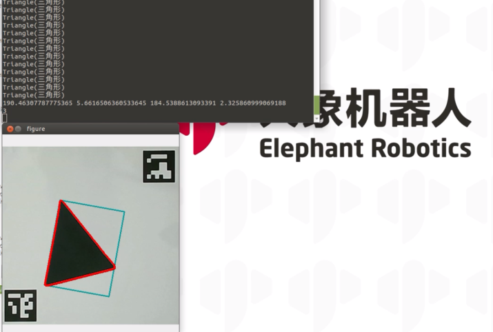
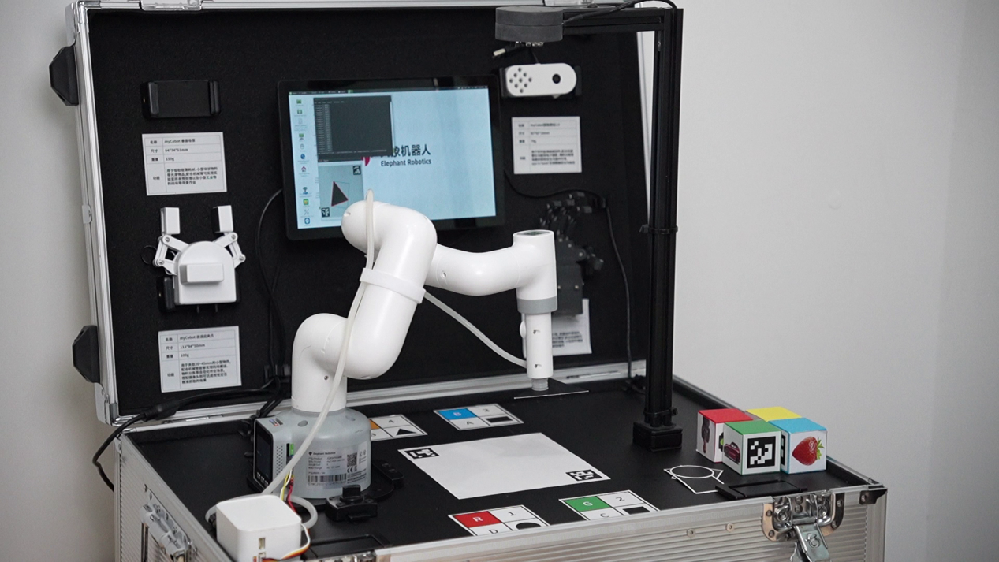

# Shape Recognition

After the system boots up, the program automatically launches. This program supports color recognition, shape recognition, feature point image recognition, AR QR code recognition, YOLOv5 image recognition, AiKit_UI, handle control, myCobot adaptive gripper examples, myCobot five-finger dexterous hand examples, and stag code tracking examples.

>>Note: The M5 version requires a device model selection before use; the PI version does not require one.

Follow the terminal prompts and select the corresponding robot arm model. Skip this step if using the PI version. Using the 280M5 as an example, enter 1:

**Press 2 to activate the shape recognition function. Place a shaped card material in the recognition area, and the robot arm will begin the gripping process.**

