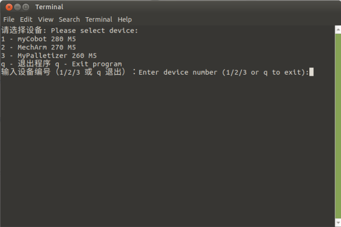

# Feature Point Recognition

After the system boots up, the program automatically launches. This program supports color recognition, shape recognition, feature point image recognition, AR QR code recognition, YOLOv5 image recognition, AiKit_UI, handle control, myCobot adaptive gripper examples, myCobot five-finger dexterous hand examples, and stag code tracking examples.

>>Note: The M5 version requires a device model selection before use; the PI version does not require one.

Follow the terminal prompts and select the corresponding robot arm model. If the PI version is used, skip this step. Here, using the 280M5 as an example, enter 1:

**Press 4 to start the feature point image recognition function. Place the feature point image block in the recognition area, and the robot arm will perform the grasping process.**

**Demo video:** 

<video id="my-video" class="video-js" controls preload="auto" width="100%"
poster="" data-setup='{"aspectRatio":"16:9"}'>
  <source src="../resources/5-BasicAlgorithmFunction/FeaturePointRecognition.mp4"></video>