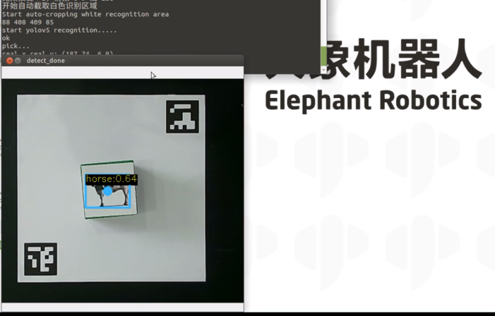

# Yolov5 Recognition

After the system boots up, the program automatically launches. This program supports color recognition, shape recognition, feature point image recognition, AR QR code recognition, YOLOv5 image recognition, AiKit_UI, handle control, myCobot adaptive gripper examples, myCobot five-finger dexterous hand examples, and stag code tracking examples.

>>Note: The M5 version requires a device model selection before use; the PI version does not require one.

Follow the terminal prompts and select the corresponding robot arm model. Skip this step if using the PI version. Using the 280M5 as an example, enter 1:

**Press 5 to start the YOLOv5 recognition function. Place the wooden block in the Yolov5 image in the recognition area. Following the prompts in the terminal output, place the mouse cursor on the camera window and press the letter z on the keyboard. The robotic arm will then execute the grabbing process.**

**Demo video:** 

<video id="my-video" class="video-js" controls preload="auto" width="100%"
poster="" data-setup='{"aspectRatio":"16:9"}'>
  <source src="../resources/5-BasicAlgorithmFunction/YOLORecognition.mp4"></video>