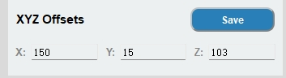
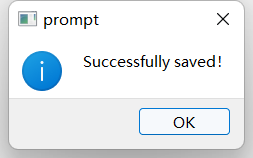

# Notes

## Coordinate Offset Modification

When running the 1-5 recognition algorithms, if the robot arm cannot accurately grasp a recognized object or block, adjust the X, Y, and Z offsets based on the algorithm. Press **number 6** to launch the AiKit_UI graphical software and modify the offsets:

The X offset, Y offset, and Z offset represent the X, Y, and Z coordinate positions of the robot arm, respectively. You can modify them according to your needs. Click the 'Save' button to save the data. Once saved, the robot arm will grasp the object based on the latest position.

## Other Notes

1. The coordinate capture offsets in the recognition algorithm functions using keyboard keys 1 to 5 are dependent on the offsets in AiKit_UI. Therefore, to adjust the coordinate offsets, press **key 6** to launch the AiKit_UI program and save the changes.

2. This program supports direct switching between recognition algorithm functions. For example, if you are currently running the color recognition function, you can directly enter 2 to switch to the shape recognition function. If you are currently running the AiKit_UI program, you must manually close the program in the upper right corner of the UI program before you can switch to other recognition algorithm functions.

3. If the camera does not automatically define the recognition area correctly, close the program and adjust the camera position by moving it left or right.

4. OpenCV color recognition is affected by the environment. Recognition performance will be significantly reduced in dim or bright environments.

5. Different recognition algorithm functions correspond to different materials. Please select the appropriate one. 6. The myPalletizer 260 device only has function buttons 1-8, and the mechArm 270 device only has function buttons 1-9.