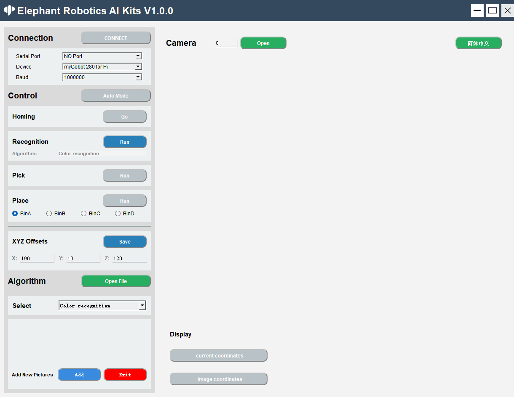
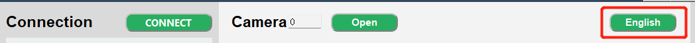
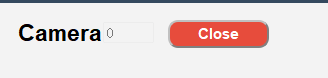
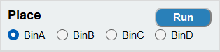
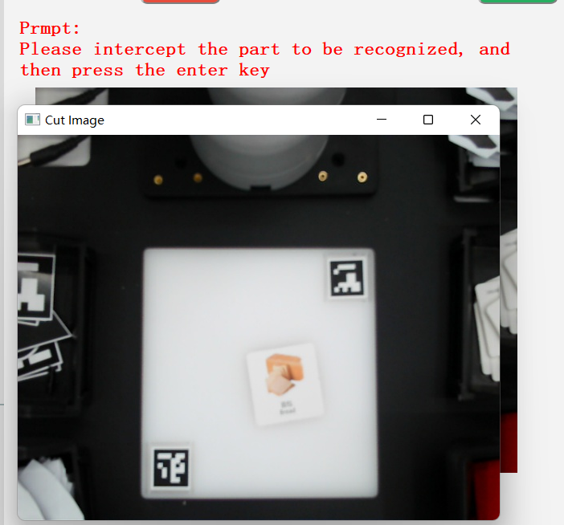

# Using the AiKit UI

After the system boots up, the program automatically launches. This program supports color recognition, shape recognition, feature point image recognition, AR QR code recognition, YOLOv5 image recognition, the AiKit_UI program, the handle control program, the myCobot adaptive gripper example, the myCobot five-finger dexterous hand example, and the stag code tracking example.

Using Python + OpenCV + PyQt5, perform color recognition, shape recognition, feature point image recognition, AR QR code recognition, and YOLOv5 image recognition on the robotic arm.

>>Note: The M5 version requires a device model selection before use; the PI version does not.

Select the corresponding robotic arm model according to the terminal prompt. Skip this step if using the PI version. Using the 280M5 as an example, enter 1:

**Press 6 to launch the AiKit_UI graphical program, allowing you to directly use various algorithm recognition functions. Here we use color recognition as an example**

**Demo Video:**

<video id="my-video" class="video-js" controls preload="auto" width="100%"
poster="" data-setup='{"aspectRatio":"16:9"}'>
<source src="../resources/5-BasicAlgorithmFunction/AIKIT-UI.mp4"></video>

## Function Introduction

### language switch

Click the button in the upper right corner of the window to switch between languages (Chinese, English). 

### device connection

1. Select serial port, device, baud rate 
   

2. Click the 'CONNECT' button to connect, after the connection is successful, the 'CONNECT' button will change to 'DISCONNECT' 
   

3. Clicking the 'DISCONNECT' button will disconnect the robot arm 
   

4. After the robotic arm is successfully connected, the gray button will be lit and become clickable. 
   

### Turn on the camera

1. Set the camera serial number, the default serial number is 0, when Windows is used, the serial number is usually 1, and when Linux is used, the serial number is usually 0. 
   

2. Click the 'Open' button to try to open the camera. If the opening fails, you should try to change the camera serial number; the camera is successfully opened as shown in the figure below: Note: Before use, the camera should be adjusted to be just above the QR code whiteboard, and there is a line The straight line is facing the mechanical arm. 
   

3. After successfully opening the camera, click the 'Close' button to close the camera 
   

### algorithm control

1. Fully automatic mode, after clicking the 'Auto Mode' button, the recognition, grabbing, and placing will always be on; click the 'Auto Mode' button again to turn off the fully automatic mode. 
   

2. Go back to the initial point of grabbing, click the 'Go' button, it will stop the current operation and return to the initial point. 

3. Step-by-step 
   Recognition recognition: click the 'Run' button to start the recognition, Aigorithm is the current algorithm used.  
   
   Pick: Click the 'Run' button to start the capture. After the capture is successful, the recognition and capture will be automatically closed, and you need to click it again for the next use.  
   
   Placement: Click the 'Run' button to start placing. The BinA, BinB, BinC, and BinD selection boxes correspond to BinA, BinB, BinC, and BinD 4 storage boxes, respectively, and will be placed in the designated storage box after selection. 
   

4. Grasping point adjustment, X offset, Y offset, Z offset respectively represent the position of the X-axis, Y-axis, and Z-axis of the robot arm coordinates. They can be modified according to actual needs. Click the 'Save' button Save it. After successful saving, it will be captured according to the latest point. 
    
   

5. Open the file location, our code is open source, you can modify it according to your needs, click the 'Open File' button to open the file location.  
   Open the 'main.py' file and modify it  
    

6. Algorithm selection includes color recognition, shape recognition, two-dimensional code recognition, Keypoints recognition and yolov5 recognition. Selecting the corresponding algorithm will perform corresponding recognition. 
   

7. Add a picture for 'Keypoints'  
   
   Click the 'Add' button, the camera will open and a prompt will appear.  
   
   Click the 'Cut' button, the current camera content will be intercepted, and a prompt will be given to 'press the ENTER key after the content needs to be saved' 

   
   Frame the content to be saved and press the ENTER key to start selecting the saved area, corresponding to BinA, BinB, BinC, BinD 4 storage boxes. 

   
   The intercepted content will be displayed here 
   

   You can enter the following path to view the saved pictures 
   

8. Click the 'Exit' button to exit adding pictures. Note: If you start capturing, please exit after capturing. You can choose not to save the captured pictures. 
   

### coordinate display

1. Real-time coordinate display of the robotic arm: click the 'current coordinates' button to open 

2. Recognition coordinate display: click the ''image coordinates' button to open 
   