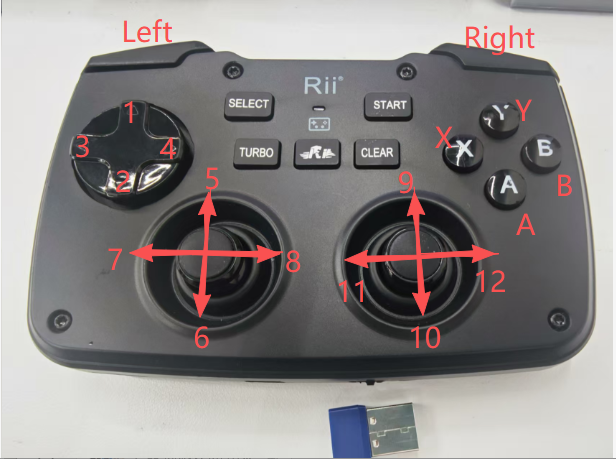
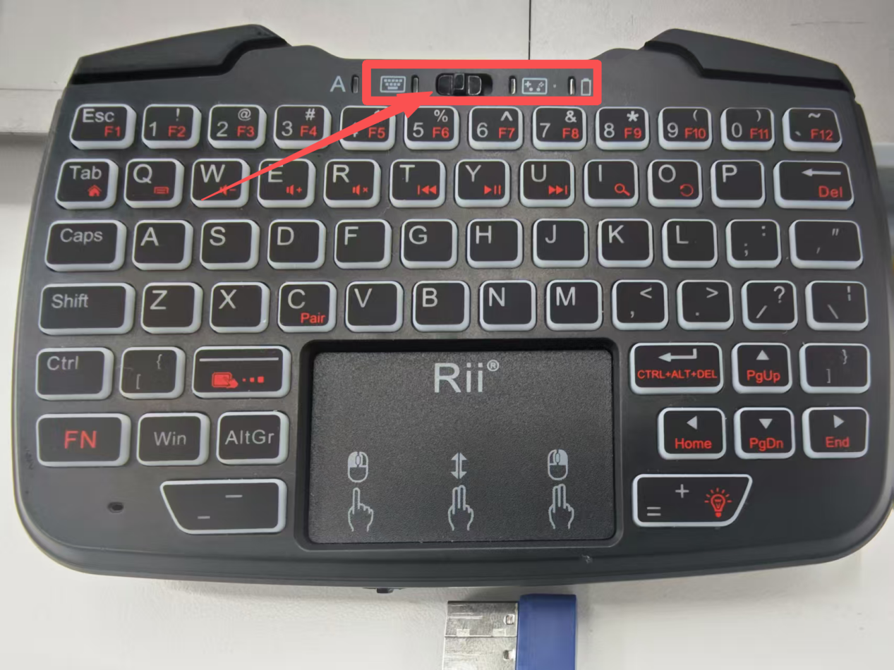
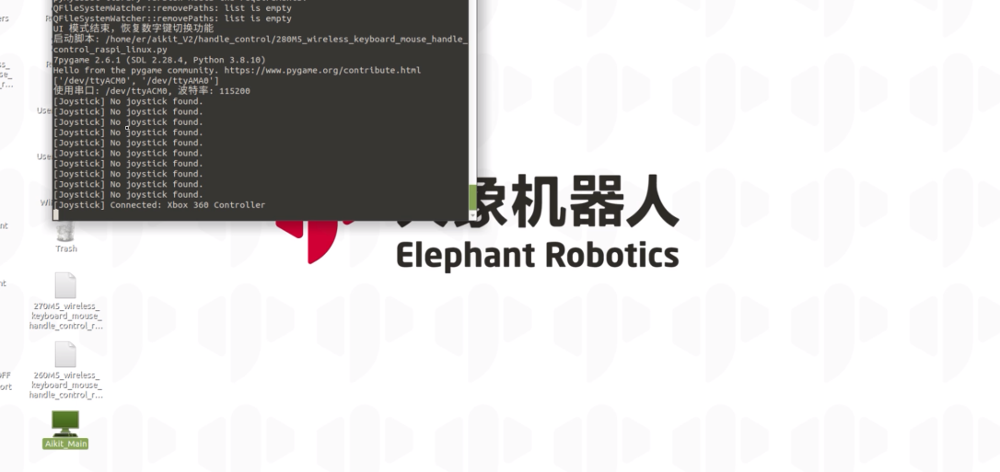
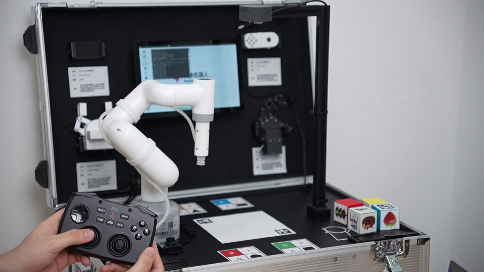

# Handle Control

Upon system startup, the system automatically launches a program that supports color recognition, shape recognition, feature point image recognition, AR QR code recognition, YOLOv5 image recognition, AiKit_UI, handle control, the myCobot adaptive gripper example, the myCobot five-finger dexterous hand example, and stag code tracking.

The handle allows you to control the robot's movements, enabling grippers or suction pumps to grasp objects.

- The handle button functions are as follows:

- **1**: Increase RX coordinate value
- **2**: Decrease RX coordinate value
- **3**: Increase RY coordinate value
- **4**: Decrease RY coordinate value
- **5**: Increase X coordinate value
- **6**: Decrease X coordinate value
- **7**: Increase Y coordinate value
- **8**: Decrease Y coordinate value
- **9**: Decrease Z coordinate value
- **10**: Increase Z coordinate value
- **11**: Decrease RZ coordinate value
- **12**: Increase RZ coordinate value
- **X**: Click the button to open the adaptive gripper
- **Y**: Click the button to close the adaptive gripper
- **A**: Click the button to turn on the suction pump
- **B**: Click the button to turn off the suction pump
- **Left1**: Press and hold for 2 seconds to initialize the robot to the joint zero position.
- **Left2**: Press and hold for 2 seconds to stop the robot from outputting torque and relax all joints.
- **Right1: Press and hold for 2 seconds to initialize the robot to its initial position.**
- **Right2**: Press and hold for 2 seconds to enable torque output and lock all joints.

>>Note: M5 version robots require a device model selection before use; PI versions do not require this.

Follow the terminal prompts and select the corresponding robot arm model. Skip this step if using a PI version. Using the 280M5 as an example, enter 1:

**Press 7 to enable joystick control. After booting up, you'll need to switch your keyboard and mouse to gamepad control mode. The following table describes how to use the gamepad buttons. (After running the program, first click the Right 1 button. Once the device reaches the initial position, you can perform other operations.)

- The gamepad keyboard and keyboard modes are as follows: Pull the button to the left to switch to keyboard mode, and to the right to switch to gamepad control mode.

**Demo video:**

<video id="my-video" class="video-js" controls preload="auto" width="100%"
poster="" data-setup='{"aspectRatio":"16:9"}'> 
<source src="../resources/5-BasicAlgorithmFunction/JoystickControl.mp4"></video>