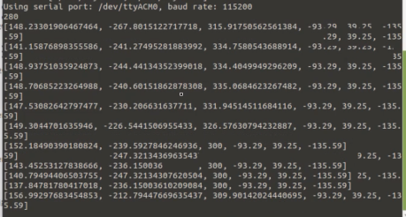
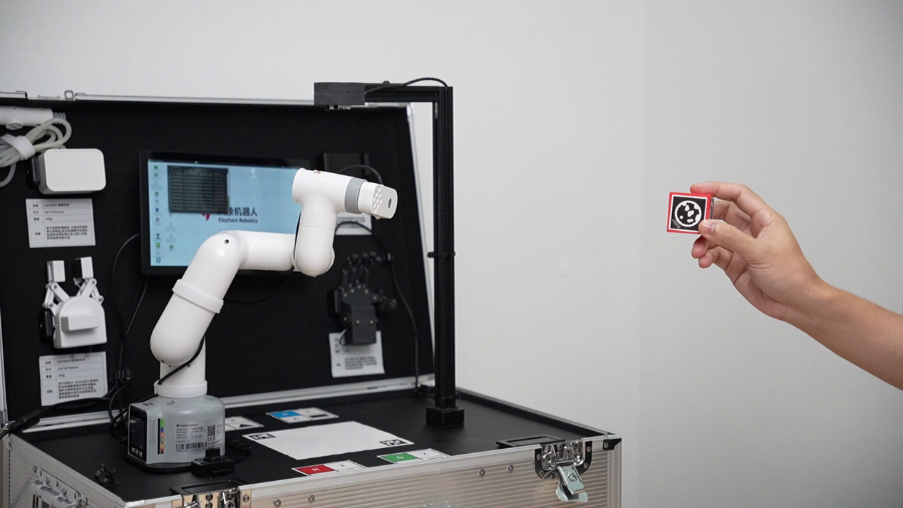
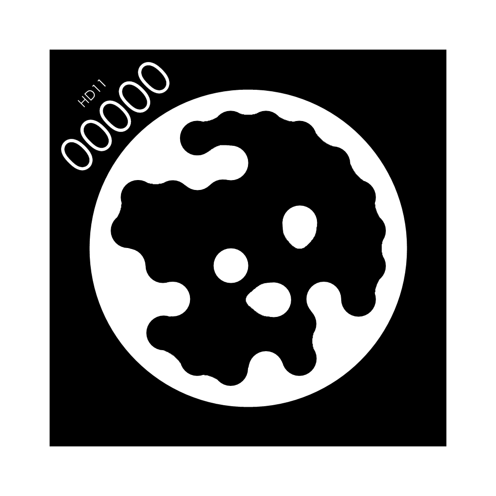

# STAG Code Tracking Example

>> Install the camera at the end of the robotic arm. This feature uses an eye-in-hand method. After reinstalling the camera, perform a hand-eye calibration. (Note: 260 and 270 devices do not support this feature.)

After the system boots up, the program automatically launches. This program supports color recognition, shape recognition, feature point image recognition, AR QR code recognition, YOLOv5 image recognition, AiKit_UI, handle control, myCobot adaptive gripper example, myCobot five-finger dexterous hand example, and STAG code tracking example.

>>Note: The M5 version requires a device model selection before use; the PI version does not require one.


Follow the terminal prompts and select the corresponding robot arm model. Skip this step if using the PI version. Using the 280M5 as an example, enter 1:


**Press 0 to start the STAG code tracking example function. First, the robotic arm moves to the initial observation point position. Then, the stag block maintains a 30cm distance from the camera flange at the end of the robotic arm, and the robotic arm begins tracking.**





Demo Video:

<video id="my-video" class="video-js" controls preload="auto" width="100%"
poster="" data-setup='{"aspectRatio":"16:9"}'>
<source src="../resources/5-BasicAlgorithmFunction/StagCodeTracking.mp4"></video>

## Stag Code

This article uses stag codes for QR code tracking. Color printing is recommended, as black and white printing has a lower recognition rate.



Download link: [Stag Code Download](https://drive.google.com/drive/folders/0ByNTNYCAhWbILXd2SE5FY1c3WXM?resourcekey=0-nWeENtNZql2j9AF32Ud8sQ)

**Note:** The stag code has a number in the upper left corner. This number can be identified using the OpenCV stag recognition library. You can design different behavior logic for different numbers, for example, 00 for position tracking and 01 for returning to the observation point.

## Hand-Eye Calibration

### 2.1 Hand-Eye Matrix Principle

Hand-eye calibration is an essential step in visual tracking. Its purpose is to determine the relative relationship between the robot arm coordinate system (hand) and the camera coordinate system (eye). We represent this relative relationship using a 4x4 hand-eye matrix. For detailed explanations, please refer to the following link: [Hand-Eye Matrix Principle](https://blog.csdn.net/weixin_45844515/article/details/125571550)

### 2.2 Hand-Eye Calibration Method

>> Note: Hand-eye calibration is required after reinstalling the camera.

Mount the camera on the robotic arm (usually at the end of the robotic arm) and connect it to the robotic arm to be controlled.

Modify the contents of the `home/er/convenient_aikit/AiKit_280M5/scripts/camera_detect.py` file as follows:

```python
if __name__ == "__main__":
# Load camera configuration parameters
camera_params = np.load("/home/er/convenient_aikit/AiKit_280M5/scripts/camera_params.npz")
mtx, dist = camera_params["mtx"], camera_params["dist"]

# Initialize the camera detector
m = camera_detect(0, 32, mtx, dist)

# Disable vision mode initially
mc.set_vision_mode(0)

# Uncomment the following lines to run specific functions
# m.camera_open_loop() # Open camera in a continuous loop
# m.stag_identify_loop() # Continuously detect STAG markers
# m.stag_robot_identify_loop(mc) # Continuously calculate robot coordinates based on STAG
m.Eyes_in_hand_calibration(mc) # Calibrate Eyes-in-Hand matrix
# m.vision_trace(0, mc) # Perform a one-time vision trace

# Start a continuous vision trace loop
# m.vision_trace_loop(mc)
```

Save the changes and run the command:

```bash
cd ~/convenient_aikit/AiKit_280M5/scripts/
python3 camera_detect.py
```

At this point, the robot arm will first move to the observation pose.

```python
offset_j5 = -90
self.origin_mycbot_level = [-45, 5, -104, 14, 90 + offset_j5, 40]
ml.send_angles(self.origin_mycbot_level, 50) # Move to observation point
```

**Note:** Users can customize the observation point, for example, by rotating the six joints to position the camera more appropriately.

1. After reaching the observation pose, the terminal will pop up the following prompt. Place the stag code within the camera's field of view and enter any key to continue recognition.

```bash
make sure the camera can observe the stag, enter any key to quit
```

2. If the camera recognizes the stag code, it will automatically proceed to the next recognition step. The robot arm will move and capture the position information of the robot arm and camera.

```bash
Move the end of the robot arm to the calibration point, press any key to release the servo.
```

3. After attaching the robot arm, press any key according to the prompt to complete the hand-eye calibration.

```bash
focus servo and get current coords
```

The EyesInHand_matrix information will be printed, indicating that the calibration is complete. The EyesInHand_matrix.json configuration file will be generated. Once the calibration is successful, there is no need to repeat the process!

For a detailed effect, refer to the following video. The effect is similar to that of the mycobot 280:

<video id="my-video" class="video-js" controls preload="auto" width="100%"
poster="" data-setup='{"aspectRatio":"16:9"}'>
<source src="../resources/5-BasicAlgorithmFunction/mycobot_hand_vision.mp4"></video>

**Note: Hand-eye calibration may be inaccurate due to improper operation, machine positioning, and other factors. If visual tracking is not effective, recalibrate the hand-eye calibration.**