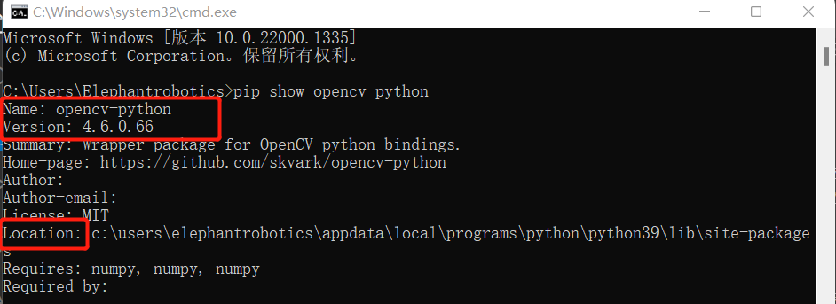
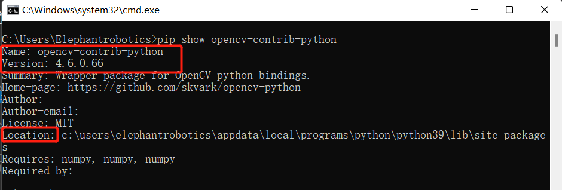
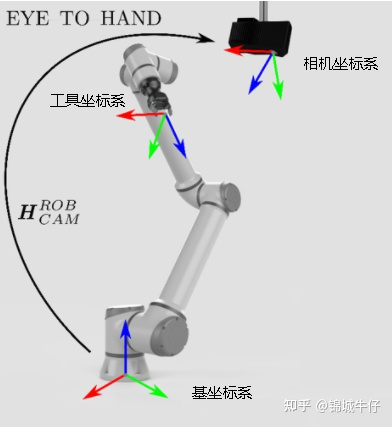
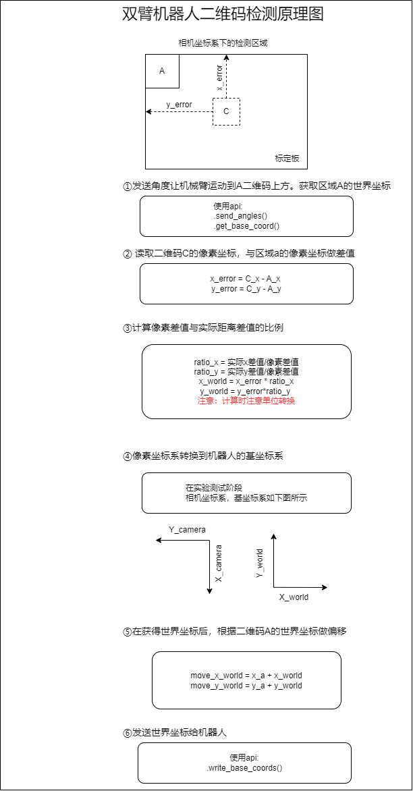
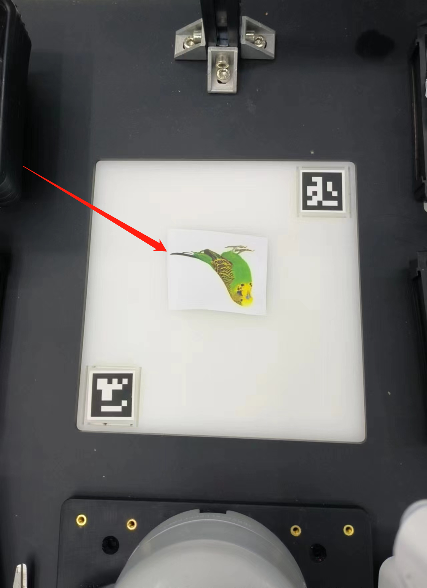

# 6.1 知识准备

## 6.1.1 什么是OpenCV

openCV全称是Open Source Computer Vision Library。是Intel（英特尔）公司开源计算机视觉库，它有一系列C函数和C++类构成，实现了图像处理和计算机视觉方面的很多通用算法。

## 6.1.2 OpenCV的安装与使用

**Windows**

打开一个控制台终端（快捷键Win+R,输入cmd，进入终端），输入以下命令：

```bash
# 二者版本号需保持一致，这里安装4.6.0.66版本
pip install opencv-python==4.6.0.66
pip install opencv-contrib-python==4.6.0.66
```

- 安装验证

```bash
# 也可查看其他python库  格式：pip show 库名称
pip show opencv-python
pip show opencv-contrib-python
```





**Linux**

打开一个控制台终端(快捷键Ctrl+Alt+T)，输入命令：

```bash
# 二者版本号需保持一致，这里安装4.6.0.66版本
pip install opencv-python==4.6.0.66
pip install opencv-contrib-python==4.6.0.66
```

**简单使用**

```bash
import cv2 
def openCamera():
    print('opencv版本',cv2.__version__)
    print("键盘ESC退出")

    cap = cv2.VideoCapture(0) # Linux
    # cap = cv2.VideoCapture(1) # Windows
    while cap.isOpened():
        sucess,frame = cap.read()
        if sucess:
            cv2.imshow("frame",frame)
            if cv2.waitKey(10)==27:
                break
    cap.release()
    cv2.destroyAllWindows()


if __name__=="__main__":
    openCamera()

```

## 6.1.3 坐标转换与标定

**1 四种坐标系**

在机械臂视觉开发中，需要进行的一个重要预备工作是理解四个坐标系的意义，即相机坐标系、 世界坐标系、工具坐标系和基坐标系。



- 世界坐标系：世界坐标系（world coordinate），也称为测量坐标系，是一个三维直角坐标系，以其为基准可以描述相机和待测物体的空间位置。世界坐标系的位置可以根据实际情况自由确定。可以理解为大地坐标系。

- 相机坐标系：相机坐标系（camera coordinate），是一个三维直角坐标系，原点位于镜头光心处，x、y轴分别与相面的两边平行，z轴为镜头光轴，与像平面垂直。

- 工具坐标系：6轴或7轴的协作臂的工具坐标系，，原点一般为机械臂的末端中心，也叫做TCP(ToolCenterPoint),Z轴于末端轴心重合，指向末端的朝向。

- 基座标系：机械臂都有基坐标系，默认原点是协作臂底座的中心点。


**2 相机标定** 

一个坐标系转换到另一个坐标系，主要包括两个方面：位置(原点)和姿态(XYZ轴向)。原点位置的变换叫做平移，姿态的变换叫做旋转

**3 像素坐标系转换为基座标系** 

* 以双臂机械臂的视觉识别作为例

通过摄像头获取图像中的像素中心点的数值，与起始点的像素中心点做差值，得出像素差值之后。根据标定设置的比例对求出的像素差值做变换。转换为世界坐标系下的差值，机械臂在获得起始点的世界坐标之后，根据计算得出的世界坐标的差值，得出实际的所要抓取的世界坐标。将该坐标发送给机械臂，即可实现定位抓取。



## 6.1.4 机械臂坐标转换与标定

* 通过测量抓取区域中的两个aruco的像素点位可计算出两个aruco的之间的像素距离M1，测量两个aruco的实际距离M2，这样我们就能获得像素与实际距离的比值 ratio = M2 / M1。我们可以从图片中计算出物块距离抓取区域中心的像素差，这样我们可以计算出物块实际距离抓取区域中心的相对坐标(x1, y1)。将相对坐标(x1, y1)加上抓取区域中心到机械臂的相对坐标(x2, y2)，即可求得物块对于机械臂的相对坐标(x3, y3)。


```bash
# 抓取中心点相对于机械臂的坐标
self.camera_x, self.camera_y = camera_x, camera_y

# 物体相对于机械臂的坐标，可以设置参数为：
self.c_x = self.c_y = 0, 0

# 像素与实际比值
self.ratio = 0

# 设置参数函数用于计算立方体和机械臂之间的坐标
def set_params(self, c_x, c_y, ratio):
    self.c_x = c_x
    self.c_y = c_y
    self.ratio = 220.0/ratio

# 获取位置函数，用于计算立方体和机械臂之间的坐标
def get_position(self, x, y):
    return ((y - self.c_y)*self.ratio + self.camera_x), ((x - self.c_x)*self.ratio + self.camera_y)

```

- 接下来，程序会调用设置参数函数 **set_params()**，用于 计算和设置计算物体和机械臂之间真实坐标的参数

```bash
detect.set_params(
                (detect.sum_x1+detect.sum_x2)/20.0,
                (detect.sum_y1+detect.sum_y2)/20.0,
                abs(detect.sum_x1-detect.sum_x2)/10.0 +
                abs(detect.sum_y1-detect.sum_y2)/10.0
            )

```

- 然后将调用函数get_position() 用于 计算立方体和 mycobot 之间的真实坐标。

```bash
real_x, real_y = detect.get_position(x, y)

```

- 最终将获取的真实坐标经过稍微处理，将其传入 **decide_move()** 函数，供后续机械臂抓取使用。

```bash
detect.decide_move(real_sx/20.0, real_sy/20.0, detect.color)
```

**注意事项**

1. **opencv-python** 和 **opencv-contrib-python** 版本库需保持一致，且版本号大于 **4.5.5**。

2. 当摄像头没有正确自动框出识别区域，需要关闭程序，调整摄像头的位置，可将摄像头向左向右移动等操作。
3. 若命令终端没有出现ok，且无法识别颜色时，需要将摄像头稍微向后或向前移动一下，当命令终端出现ok时程序即可正常运行。
4. OpenCV颜色识别会受环境的影响，若处在较为昏暗的环境下识别效果将大大降低。
5. 进行yolov5图像识别时，为了更好的识别图片需要**将物体反放在识别区域**。

