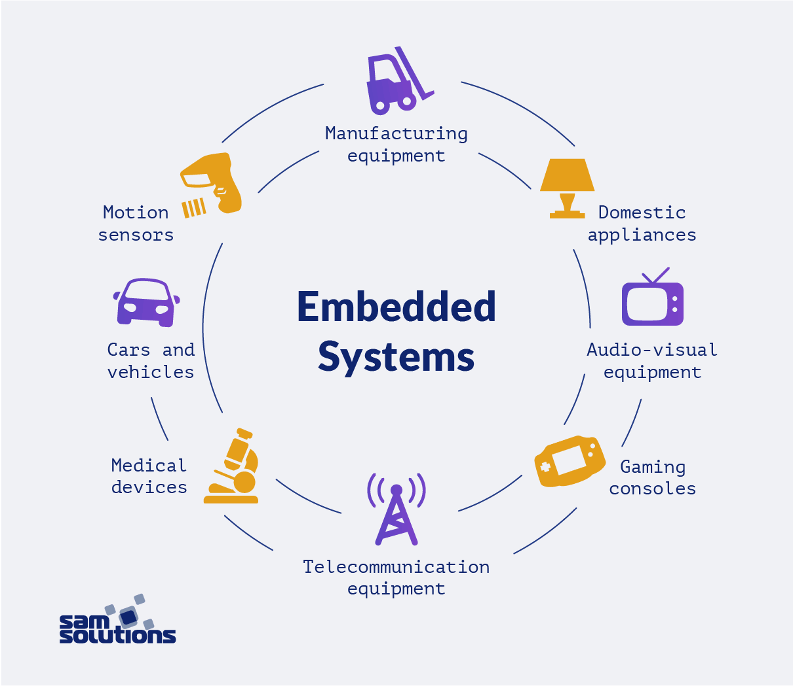
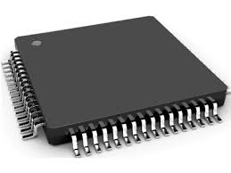

# Microcontrollers and Microcontrollers

## Introduction

A microcontroller (MCU) is an integrated circuit chip that uses very large-scale integrated circuit technology to integrate a central processing unit (CPU) with data processing capabilities, random access memory (RAM), read-only memory (ROM), various I/O ports and interrupt systems, timers/counters, and other functions (possibly also including display driver circuits, pulse-width modulation circuits, analog multiplexers, and A/D converters) onto a single silicon chip, forming a small but complete microcomputer system. It is widely used in industrial control. Since the 1980s, 4-bit and 8-bit MCUs have evolved to today's 300M high-speed MCUs.

## Basic Structure

**Arithmetic Unit**
The MCU consists of several components, including the arithmetic and logic unit (ALU), an accumulator, and registers. The ALU performs arithmetic or logical operations on data received. Its input sources are two 8-bit data, one from the accumulator and the other from the data register. The ALU can perform operations such as addition, subtraction, AND, OR, and comparison, and finally store the result in the accumulator.

The ALU has two functions:
- Perform various arithmetic operations.
- Perform various logical operations and perform logical tests, such as testing for zero or comparing two values.

All operations performed by the ALU are directed by control signals from the controller. Each arithmetic operation produces a result, and each logical operation produces a decision.

**Controller**
The controller, consisting of a program counter, instruction register, instruction decoder, timing generator, and operation controller, is the "decision-making body" that issues commands, coordinating and directing the operations of the entire microcomputer system. Its main functions are:

- Retrieve an instruction from memory and indicate the location of the next instruction in memory.
- Decode and test instructions, and generate corresponding operation control signals to execute the specified action. - Directs and controls the flow of data between the CPU, memory, and input/output devices.

The microprocessor's internal bus interconnects the ALU, counters, registers, and control unit. It also connects to external memory and input/output interface circuits via the external bus. The external bus, also known as the system bus, is divided into the data bus (DB), the address bus (AB), and the control bus (CB). Connections to various peripheral devices are established through the input/output interface circuits.

**Main Registers**
- Accumulator A

Accumulator A is the most frequently used register in a microprocessor. It serves a dual function during arithmetic and logical operations: it stores an operand before the operation and stores the sum, difference, or logical result after the operation.

- Data Register DR

The data register is a temporary storage unit for writing (writing) or reading (retrieving) data from memory and input/output devices via the data bus. It can store an instruction being decoded, a data byte being sent to memory, and so on.

- Instruction Register IR and Instruction Decoder ID

An instruction consists of an opcode and operands.
The instruction register stores the currently executed instruction. When executing an instruction, it is first fetched from memory into the data register and then transferred to the instruction register. When the system executes a given instruction, the opcode must be decoded to determine the required operation. This is the task of the instruction decoder. The output of the opcode field in the instruction register serves as the input to the instruction decoder. - Program Counter (PC)
The PC determines the address of the next instruction to ensure continuous program execution, and is therefore often called the instruction address counter. Before program execution begins, the memory address of the program's first instruction (i.e., the program's starting address) must be entered into the PC so that it always points to the address of the next instruction to be executed.

- Address Register (AR)
Address registers store the address of the memory location or I/O device that the CPU is currently accessing. Due to the speed difference between memory and the CPU, address registers are necessary to maintain address information until the memory read/write operation is complete.

Clearly, the address register and data register are used when the CPU stores data in memory, retrieves data from memory, and reads instructions from memory. Similarly, if the addresses of peripheral devices are considered memory addresses, then the address register and data register are also needed when the CPU and peripheral devices exchange information.

## Hardware Features

**Microcontrollers are relatively small in size. Their internal chip functions as a computer system, offering a simple structure but comprehensive functionality, ease of use, and modularity.**

- Microcontrollers have a high level of integration and reliability, ensuring they remain reliable even under extended operating conditions.
- Microcontrollers operate at low voltage and consume low energy, making them a primary choice for daily life and facilitating production and R&D.
- Microcontrollers have strong data processing and computing capabilities, making them suitable for use in a variety of environments and possessing robust control capabilities.

## Microcontroller Technology Development

**Microcontroller** development in electronics primarily involves CPU development, program development, memory development, computer development, and C language programming. Simultaneously developing these components ensures the smooth and orderly operation of microcontrollers in complex computer and control environments. This requires the following measures:

- CPU development. Developing the CPU bus width in microcontrollers can effectively address the slow processing capabilities of microcontrollers, improving information processing efficiency and speed. Developing and improving the actual structure of the central processing unit (CPU) allows for simultaneous operation of two or three CPUs, significantly enhancing the overall performance of the microcontroller.
- Program Development. The rational application of embedded systems has been widely promoted. Program development requires the ability to automatically execute various instructions, enabling rapid and accurate acquisition of external data and improving the efficiency of microcontroller applications.
- Memory Development. Microcontroller development should focus on memory, with increased exploration of new memory based on the read/write functions of traditional memory, enabling both static and dynamic read/write capabilities, thereby significantly improving storage performance.
- Computer Development. Further optimize and develop single-chip stress analysis and apply computer systems to achieve data transmission through communication data connections.
- C Language Program Development. Optimizing and developing the C language ensures that microcontrollers can operate normally and orderly in complex computer and control environments, promoting their widespread and comprehensive application.

******