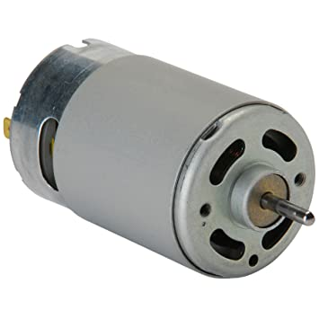
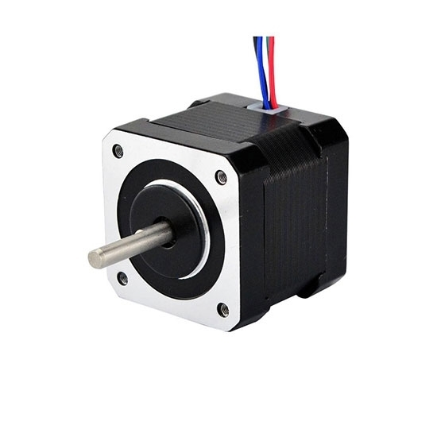
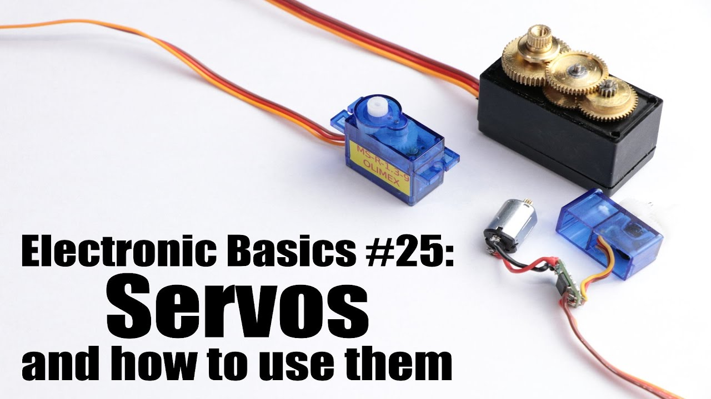

# Motor & Steering Gear

## What is a motor?

- **1 Classification by power supply**: DC motors and AC motors.
  - 1) DC motors can be classified by structure and operating principle into brushless DC motors and brushed DC motors.
    - Brushed DC motors can be classified into permanent magnet DC motors and electromagnetic DC motors.
    - Electromagnetic DC motors can be classified into series-wound DC motors, shunt-wound DC motors, separately-wound DC motors, and compound-wound DC motors.
    - Permanent magnet DC motors can be classified into rare earth permanent magnet DC motors, ferrite permanent magnet DC motors, and alnico permanent magnet DC motors.
  - 2) AC motors can be further classified into single-phase motors and three-phase motors.

- **2 Classification by application**: Drive motors and control motors.
  1) Drive motors can be categorized into: motors for power tools (including drilling, polishing, grinding, grooving, cutting, and reaming tools); motors for household appliances (including washing machines, electric fans, refrigerators, air conditioners, tape recorders, video recorders, DVD players, vacuum cleaners, cameras, hair dryers, and electric shavers); and motors for other general-purpose small mechanical equipment (including various small machine tools, small machinery, medical devices, and electronic instruments).
  2) Control motors are further categorized into: stepper motors and servo motors.

## What is a Servo?

A servo is essentially a servo motor. Because domestic users have begun using it to control the steering axis of equipment like model aircraft, these lightweight servo motors are often referred to as servos.

### What is a Servo Motor?

A servo motor is a motor that controls the operation of mechanical components in a servo system. It is a type of indirect speed-changing device that assists a motor.  
Servo motors can control speed and position with extremely high accuracy, converting voltage signals into torque and speed to drive the controlled object. The rotor speed of a servo motor is controlled by an input signal and responds quickly. In automatic control systems, it is used as an actuator. It features a small electromechanical time constant and high linearity, converting the received electrical signal into an angular displacement or angular velocity output on the motor shaft. Servo motors are classified into two categories: DC and AC. Their main characteristics are that they exhibit no self-rotation when the signal voltage is zero, and their speed decreases uniformly as torque increases.

### Working Principle of a Servo Motor

- **1. A servo system** is an automatic control system that enables an output controlled variable, such as an object's position, orientation, or state, to follow arbitrary changes in an input target (or setpoint). Servo positioning primarily relies on pulses. Basically, when a servo motor receives a pulse, it rotates by the angle corresponding to that pulse, thereby achieving displacement. Because servo motors inherently generate pulses, they send a corresponding number of pulses for each angle they rotate, forming a closed loop with the pulses they receive. This ensures that the system knows how many pulses it has sent to the servo motor and how many pulses it has received back. This allows for precise control of the motor's rotation, achieving positioning accuracy as low as 0.001mm. DC servo motors are categorized as brushless or brushless. Brushless motors offer low cost, simple structure, high starting torque, a wide speed range, and ease of control. While maintenance is inconvenient (due to carbon brush replacement), they generate electromagnetic interference and have environmental requirements. Therefore, they are suitable for cost-sensitive general industrial and consumer applications. Brushless motors are compact and lightweight, offering high output, fast response, high speed, low inertia, smooth rotation, and stable torque. While complex control is easy to implement with intelligent technology, their electronic commutation is flexible, allowing for both square-wave and sine-wave commutation. They are maintenance-free, highly efficient, operate at low temperatures, emit minimal electromagnetic radiation, and have a long lifespan, making them suitable for use in a variety of environments.

- **2. AC servo motors are also brushless motors**. They are categorized as synchronous and asynchronous motors. Synchronous motors are generally used in motion control. They have a wide power range and can achieve very high power. They also have high inertia and a low maximum rotational speed, which decreases rapidly with increasing power. Therefore, they are suitable for applications requiring low-speed, stable operation.

- **3. The rotor inside a servo motor is a permanent magnet**. The three-phase U/V/W power controlled by the driver creates an electromagnetic field, causing the rotor to rotate. Simultaneously, the motor's built-in encoder provides feedback to the driver, which compares the feedback signal with the target value and adjusts the rotor's rotation angle. The accuracy of a servo motor is determined by the encoder's accuracy (number of lines). The functional difference between AC servo motors and brushless DC servo motors is that AC servo motors are better because they use sinusoidal wave control and have low torque ripple. DC servo motors use trapezoidal wave control. However, DC servo motors are simpler and cheaper.

Industrial Servo Motors

### Servo Motor Feature Comparison
Brushless DC Servo Motor Features
Low moment of inertia, low starting voltage, and low no-load current; Eliminating contact commutation significantly increases motor speed, reaching a maximum speed of 100,000 rpm; Brushless servo motors achieve speed, position, and torque control without the need for encoders when performing servo control; They are free of brush wear and, in addition to high speed, offer long life, low noise, and zero electromagnetic interference. Brushed DC Servo Motor Features
- 1. Small size, fast action and response, high overload capacity, and wide speed range
- 2. High low-speed torque, minimal fluctuation, and smooth operation
- 3. Low noise and high efficiency
- 4. Optional rear-end encoder feedback to form a DC servo motor
- 5. Wide voltage range and adjustable frequency

### Advantages of Servomotors over Ordinary Motors
- 1. Accuracy: Achieves closed-loop control of position, speed, and torque; overcomes the problem of step loss associated with stepper motors
- 2. Speed: Excellent high-speed performance, with a rated speed generally reaching 2000-3000 rpm
- 3. Adaptability: Strong overload resistance, capable of withstanding loads up to three times the rated torque, making it particularly suitable for applications with momentary load fluctuations and requiring fast starting
- 4. Stability: Smooth low-speed operation without the stepping phenomenon associated with stepper motors. Suitable for applications requiring high-speed response;
- 5. Timeliness: The motor's dynamic response time for acceleration and deceleration is short, generally within tens of milliseconds;
- 6. Comfort: Heat generation and noise are significantly reduced.

Simply put, after power is removed, ordinary motors will continue to rotate for a while due to their own inertia before stopping. Servo motors and stepper motors, on the other hand, can stop and start instantly, with extremely fast response. However, stepper motors can lose steps.

### Application Scenarios of Servo Motors
Servo motors have numerous applications. Any application that requires a power source and requires high precision generally involves a servo motor. Examples include machine tools, printing equipment, packaging equipment, textile equipment, laser processing equipment, robots, automated production lines, and other equipment that demand relatively high process precision, efficiency, and reliability.
