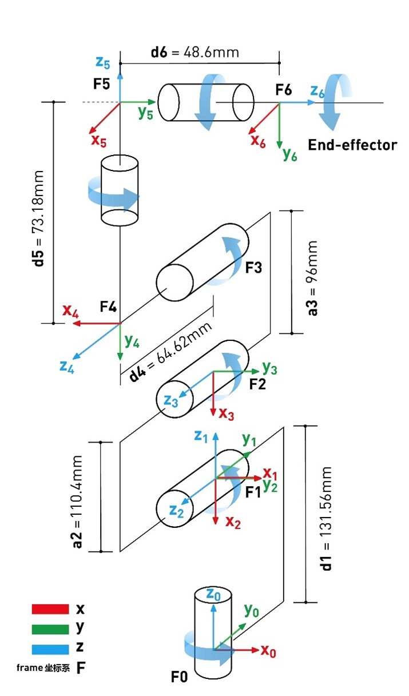
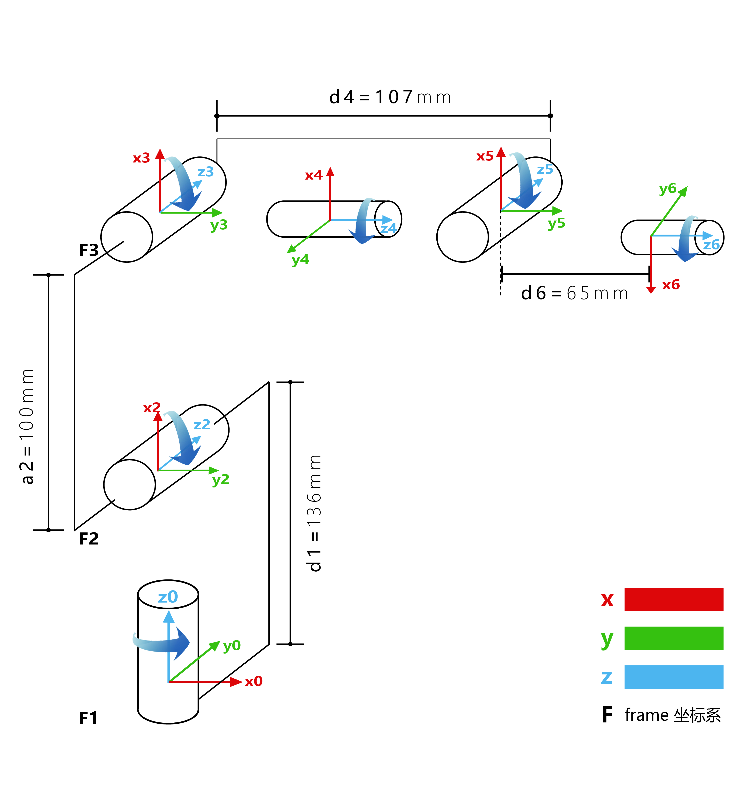

# myCobot 280 algorithm

## 1 Structural Parameters

### 1.1 Robotic Arm DH Parameters

| joint | theta |   d   |   a   | alpha | offset |
| :---- | :---- | :---- | :---- | :---- | :----  |
| 1 | q1 |   131.22   |   0   | 1.5708 | 0 |
| 2 | q2 |   0   |   -110.4   | 0 | -1.5708 |
| 3 | q3 |   0   |   -96   | 0 | 0 |
| 4 | q4 |   63.4   |   0   | 1.5708 | -1.5708 |
| 5 | q5 |   75.05   |   0   | -1.5708 | 1.5708 |
| 6 | q6 |   45.6   |   0   | 0 | 0 |

### 1.2 Kinematic Model

# MechArm 270 algorithm

## DH Parameters

