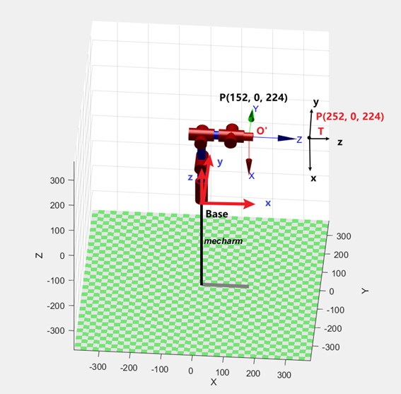

# myCobot 280 algorithm

## 1 Structural Parameters

### 1.1 Robotic Arm DH Parameters

| joint | theta |   d   |   a   | alpha | offset |
| :---- | :---- | :---- | :---- | :---- | :----  |
| 1 | q1 |   131.22   |   0   | 1.5708 | 0 |
| 2 | q2 |   0   |   -110.4   | 0 | -1.5708 |
| 3 | q3 |   0   |   -96   | 0 | 0 |
| 4 | q4 |   63.4   |   0   | 1.5708 | -1.5708 |
| 5 | q5 |   75.05   |   0   | -1.5708 | 1.5708 |
| 6 | q6 |   45.6   |   0   | 0 | 0 |

### 1.2 Kinematic Model

## 2 Coordinate System Introduction

### 2.1 Tool Coordinate System

The figure shows a Mecharm robot model. Base represents the robot's base coordinate system, O' represents the end flange coordinate system, and point P represents the position of the end arm relative to the base coordinate system (x=152, y=0, z=224).

Based on the end flange, a certain pose is extended, and the set tool point is considered the end of the machine.

The T in the figure is the tool coordinate system. The posture of this coordinate system is consistent with O’, and the origin position has a relative displacement. Use the Python function to set the tool coordinate system.

- set_tool_reference([x, y, z, rx, ry, rz]) //Set the tool coordinate system
- set_end_type(1) //Set the end coordinate system type to tool
- Since the tool coordinate system T does not rotate relative to O’, rx = ry = rz = 0
- Assume that the origin of the tool coordinate system T in the coordinate system O’ is (x = 0, y = 0, z = 100mm)
- The final tool coordinate system parameters are set_tool_reference(0, 0, 100, 0, 0, 0)

Since the tool coordinate system is set, the robot's end point now extends from O' to T. The read end point coordinates become (152+100, 0, 224), and the coordinate pose motion will rotate around the tool point T.

### 2.2 World Coordinate System

Section 2 introduced how to extend the robot arm's end-of-arm coordinate system to a certain pose by setting the tool coordinate system. We can also extend the robot arm's base coordinate system to a certain pose by setting the world coordinate system. The set world coordinate system will replace the original base coordinate system and become the new base coordinate system.

The W in the figure is the set world coordinate system. The posture of this coordinate system is consistent with the Base, and the origin position has undergone relative displacement. Use the Python function to set the world coordinate system.

- set_world_reference([x, y, z, rx, ry, rz]) //Set the world coordinate system
- set_reference_frame(1) //Set the base coordinate system type to world
- Assume that the world coordinate system W has not rotated relative to the Base, rx = ry = rz = 0
- Assume that the origin of the world coordinate system W in the coordinate system Base is (x = 0, y = 0, z = -100mm)
- The final world coordinate system parameters are set_world_reference(0, 0, -100, 0, 0, 0)

Since the world coordinate system is set, the robot's origin now extends from the Base to the W, and the read O' coordinate becomes (152, 0, 224+100).

