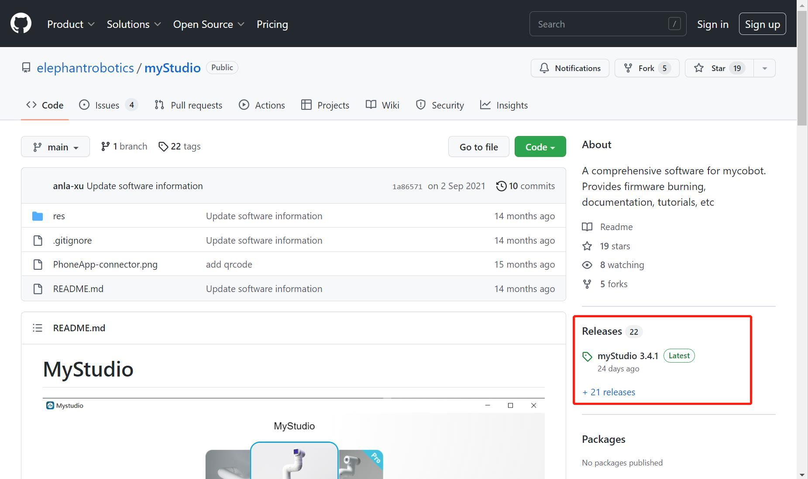
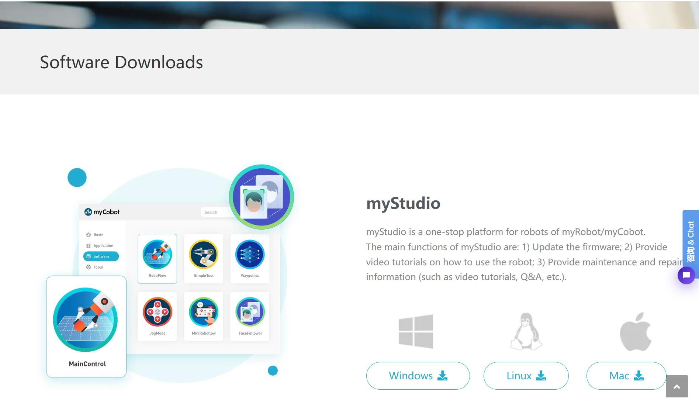
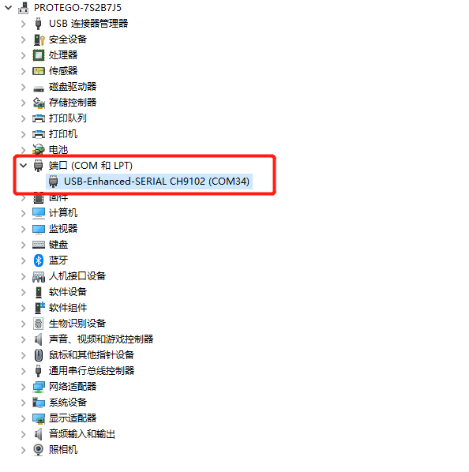
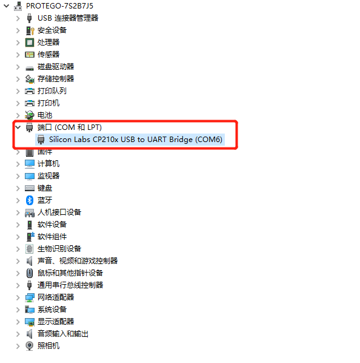

# 1 Environment Building

## 1.1 Download and Installation

>Note：The installation path of myStudio installation cannot have any spaces

address for downloading:

**1. [GitHub](https://github.com/elephantrobotics/myStudio)**

* Click on `myStudio`  at the right side and download the version corresponding to your PC. **Do not install myStudio into files with space directory.** 

* Different suffixes represent versions suitable for different operating systems. Please download the appropriate version:
* *.tra.xz - Linux
* *.dmg - Mac
* *.exe - Windows

**2. [Official Website](https://www.elephantrobotics.com/download/)**

Download the software based on your computer system.

> **Note:** Please download the latest version. You can check the current version in the downloaded myStudio interface and update to the latest version.

## 1.2 Driver Installation

Users can download the corresponding **CP210X** or **CP34X** driver package for their operating system by clicking the button below. After unzipping the package, select the installation package corresponding to your operating system's bitness.

Currently, there are two driver chip versions: **CP210X** (for the CP2104 version) and **CP34X** (for the CH9102 version). If you're unsure of the USB chip your device uses, you can install both drivers simultaneously. (**CH9102_VCP_SER_MacOS** may display an error during installation, but the installation is complete; you can ignore it.)

For Mac OS, before installing, ensure that "Preferences -> Security & Privacy -> General" is enabled and that downloads from the App Store and approved developers are permitted.

- Download the **M5Stack-basic** serial port driver from the bottom

  - **CP210X**
    - [ **Windows 10** ](https://download.elephantrobotics.com/software/drivers/CP210x_VCP_Windows.zip)
    - [ **MacOS** ](https://download.elephantrobotics.com/software/drivers/CP210x_VCP_MacOS.zip)
    - [ **Linux** ](https://download.elephantrobotics.com/software/drivers/CP210x_VCP_Linux.zip)

  * **CP34X**

    - [ **Windows 10** ](https://download.elephantrobotics.com/software/drivers/CH9102_VCP_SER_Windows.exe)

    - [ **MacOS** ](https://download.elephantrobotics.com/software/drivers/CH9102_VCP_MacOS.zip)

- Download the terminal **Atom** serial port driver.
  - [ **Windows10** ](https://download.elephantrobotics.com/software/drivers/CDM21228_Setup.zip)

## 1.3 How to distinguish between CP210X and CP34X chips

- As shown below, open the **Device Manager** and check **Ports (COM and LPT)**.

* If **Ports (COM and LPT)** displays **USB-Enhanced-SERIAL CH9102**, it's a **CP34X chip**.

* If **Ports (COM and LPT)** displays **Silicon Labs CP210x USB to UART Bridge**, it's a **CP210X chip**.

