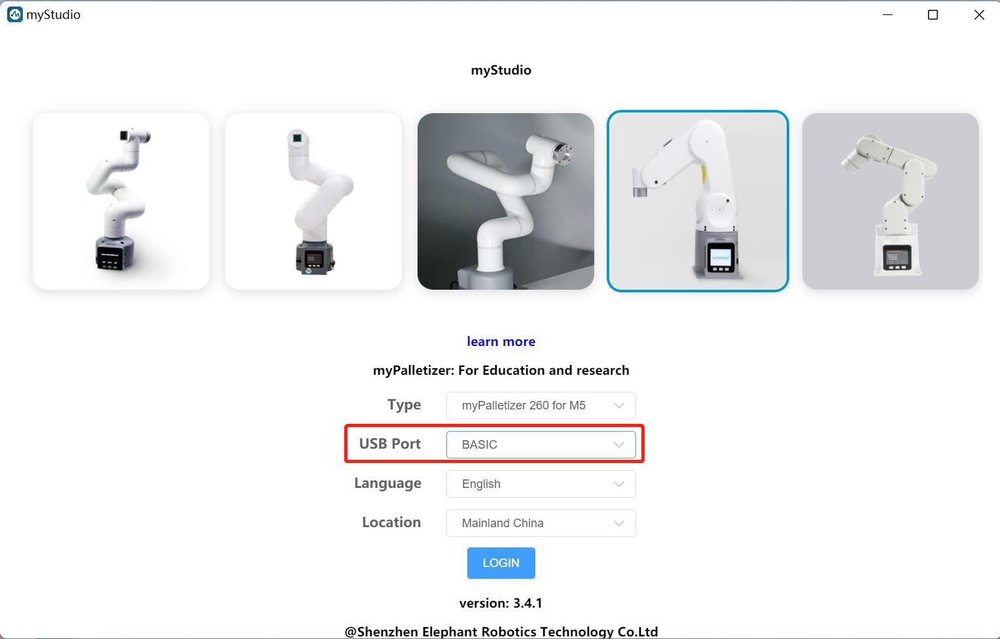
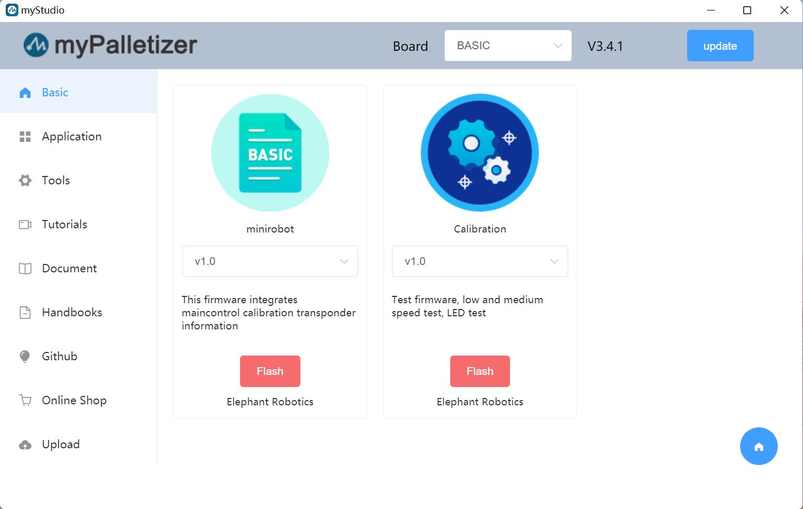

# 2 Burning and Updating the Firmware

**[myStudio Video Tutorial](https://www.bilibili.com/video/BV1Qr4y1N7B5/)**

## 2.1 Burning the M5Stack-Basic Firmware

> **Note: Pi series robotic arms do not require burning the M5Stack-Basic firmware.**

Step 1: Connect to the PC. The M5Stack-Basic and PC connection diagram is shown below:

Step 2: Select the port. After connecting, the connected development board will be displayed under the USB Port section in myStudio's Connection window (this example uses the myPalletizer 260M5 version):

Step 3: Click Login -> M5Stack-basic to flash the required firmware:

> **Note:** The 280 PI/Jetson nano/Arduino version does not include M5Stack-basic, so "No Data" will be displayed after connecting to myStudio.

## 2.2 Flashing the Atom Firmware

Step 1: Connect to your PC. Connect the Atom to the USB port.

Step 2: Select ATOM in the Board column. The Atom firmware will appear in the Basic section of the sidebar. There is only one firmware for the Atom; click to flash it (the image below uses myCobot 280 as an example).

